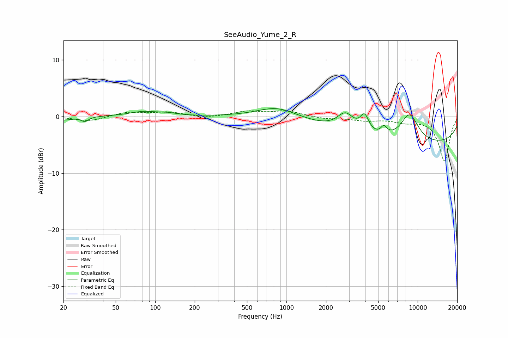

# SeeAudio_Yume_2_R
See [usage instructions](https://github.com/jaakkopasanen/AutoEq#usage) for more options and info.

### Parametric EQs
Apply preamp of -1.5 dB when using parametric equalizer.

|   # | Type    |   Fc (Hz) |    Q |   Gain (dB) |
|-----|---------|-----------|------|-------------|
|   1 | Peaking |        20 | 2.21 |        -0.6 |
|   2 | Peaking |        29 | 5.03 |        -0.8 |
|   3 | Peaking |        81 | 1.33 |         0.8 |
|   4 | Peaking |       125 | 2.05 |         0.4 |
|   5 | Peaking |       848 | 0.96 |         1.9 |
|   6 | Peaking |      2820 | 2.21 |         3.1 |
|   7 | Peaking |      3937 | 4.26 |         3   |
|   8 | Peaking |      5526 | 5.91 |         1.4 |
|   9 | Peaking |      8666 | 1.85 |         5   |
|  10 | Peaking |     10000 | 0.19 |        -4.9 |

### Fixed Band EQs
When using fixed band (also called graphic) equalizer, apply preamp of **-1.1 dB** (if available) and set gains manually with these parameters.

|   # | Type    |   Fc (Hz) |    Q |   Gain (dB) |
|-----|---------|-----------|------|-------------|
|   1 | Peaking |        31 | 1.41 |        -0.9 |
|   2 | Peaking |        62 | 1.41 |         0.8 |
|   3 | Peaking |       125 | 1.41 |         0.7 |
|   4 | Peaking |       250 | 1.41 |        -0.3 |
|   5 | Peaking |       500 | 1.41 |         0.8 |
|   6 | Peaking |      1000 | 1.41 |         0.9 |
|   7 | Peaking |      2000 | 1.41 |        -0.4 |
|   8 | Peaking |      4000 | 1.41 |        -0.6 |
|   9 | Peaking |      8000 | 1.41 |        -0.8 |
|  10 | Peaking |     16000 | 1.41 |        -7.9 |

### Graphs

