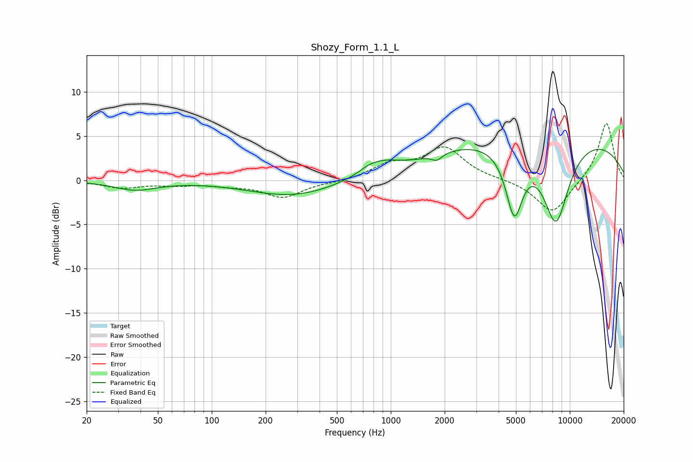

# Shozy_Form_1.1_L
See [usage instructions](https://github.com/jaakkopasanen/AutoEq#usage) for more options and info.

### Parametric EQs
Apply preamp of -3.6 dB when using parametric equalizer.

|   # | Type    |   Fc (Hz) |    Q |   Gain (dB) |
|-----|---------|-----------|------|-------------|
|   1 | Peaking |        37 | 1.18 |        -1   |
|   2 | Peaking |       287 | 0.57 |        -1.9 |
|   3 | Peaking |       748 | 2.83 |         0.3 |
|   4 | Peaking |       845 | 2.31 |        -0.2 |
|   5 | Peaking |       873 | 1.57 |         1.3 |
|   6 | Peaking |      1463 | 1.28 |        -0.3 |
|   7 | Peaking |      1811 | 4.96 |        -0.7 |
|   8 | Peaking |      4896 | 2.88 |        -7.6 |
|   9 | Peaking |      7117 | 0.18 |         5.5 |
|  10 | Peaking |      8364 | 1.71 |        -9.5 |

### Fixed Band EQs
When using fixed band (also called graphic) equalizer, apply preamp of **-6.5 dB** (if available) and set gains manually with these parameters.

|   # | Type    |   Fc (Hz) |    Q |   Gain (dB) |
|-----|---------|-----------|------|-------------|
|   1 | Peaking |        31 | 1.41 |        -0.8 |
|   2 | Peaking |        62 | 1.41 |        -0.4 |
|   3 | Peaking |       125 | 1.41 |        -0.4 |
|   4 | Peaking |       250 | 1.41 |        -1.9 |
|   5 | Peaking |       500 | 1.41 |        -0.2 |
|   6 | Peaking |      1000 | 1.41 |         1.6 |
|   7 | Peaking |      2000 | 1.41 |         3.6 |
|   8 | Peaking |      4000 | 1.41 |         0.1 |
|   9 | Peaking |      8000 | 1.41 |        -3.8 |
|  10 | Peaking |     16000 | 1.41 |         6.6 |

### Graphs

