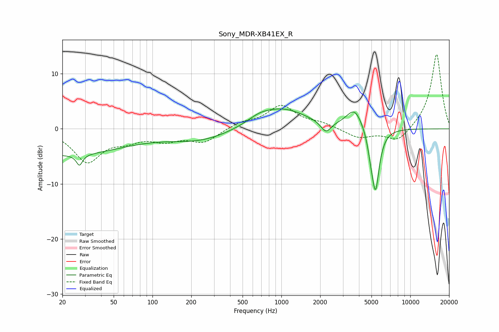

# Sony_MDR-XB41EX_R
See [usage instructions](https://github.com/jaakkopasanen/AutoEq#usage) for more options and info.

### Parametric EQs
Apply preamp of -3.7 dB when using parametric equalizer.

|   # | Type    |   Fc (Hz) |    Q |   Gain (dB) |
|-----|---------|-----------|------|-------------|
|   1 | Peaking |        20 | 0.28 |        -4.7 |
|   2 | Peaking |        27 | 5.91 |         3.3 |
|   3 | Peaking |        27 | 5.97 |        -5.3 |
|   4 | Peaking |       233 | 0.59 |        -2   |
|   5 | Peaking |       672 | 1.57 |         1   |
|   6 | Peaking |      1018 | 0.74 |         3.6 |
|   7 | Peaking |      2218 | 3.62 |        -2.1 |
|   8 | Peaking |      3698 | 2.24 |         3.7 |
|   9 | Peaking |      4944 | 5.98 |        -2.1 |
|  10 | Peaking |      5374 | 4.6  |       -11.2 |

### Fixed Band EQs
When using fixed band (also called graphic) equalizer, apply preamp of **-13.6 dB** (if available) and set gains manually with these parameters.

|   # | Type    |   Fc (Hz) |    Q |   Gain (dB) |
|-----|---------|-----------|------|-------------|
|   1 | Peaking |        31 | 1.41 |        -5.8 |
|   2 | Peaking |        62 | 1.41 |        -1.6 |
|   3 | Peaking |       125 | 1.41 |        -1.8 |
|   4 | Peaking |       250 | 1.41 |        -2.3 |
|   5 | Peaking |       500 | 1.41 |         1.1 |
|   6 | Peaking |      1000 | 1.41 |         4.1 |
|   7 | Peaking |      2000 | 1.41 |         0.9 |
|   8 | Peaking |      4000 | 1.41 |        -1.7 |
|   9 | Peaking |      8000 | 1.41 |        -2.5 |
|  10 | Peaking |     16000 | 1.41 |        13.7 |

### Graphs

