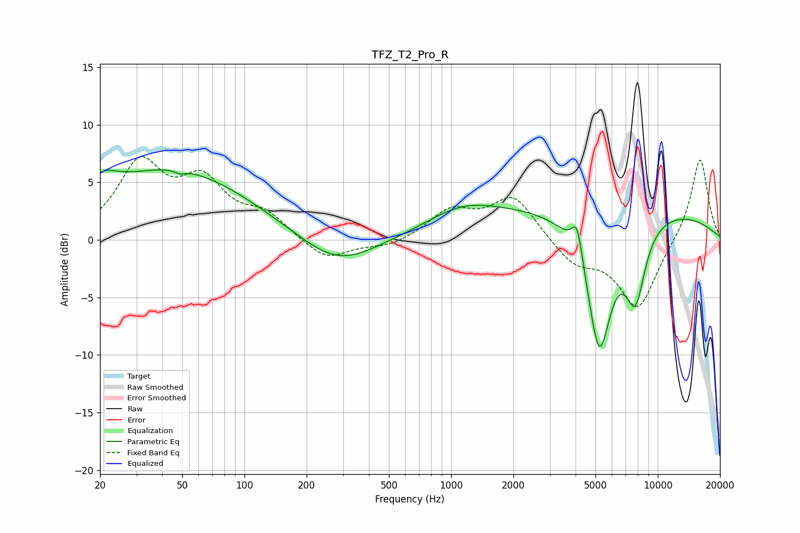

# TFZ_T2_Pro_R
See [usage instructions](https://github.com/jaakkopasanen/AutoEq#usage) for more options and info.

### Parametric EQs
Apply preamp of -6.2 dB when using parametric equalizer.

|   # | Type    |   Fc (Hz) |    Q |   Gain (dB) |
|-----|---------|-----------|------|-------------|
|   1 | Peaking |        20 | 1.9  |         1.8 |
|   2 | Peaking |        45 | 0.37 |         6.1 |
|   3 | Peaking |        50 | 5.8  |        -3.4 |
|   4 | Peaking |        50 | 5.8  |         3.1 |
|   5 | Peaking |       282 | 0.77 |        -2.7 |
|   6 | Peaking |      1122 | 0.86 |         1.5 |
|   7 | Peaking |      4072 | 5.41 |         3   |
|   8 | Peaking |      5210 | 2.23 |       -11.9 |
|   9 | Peaking |      5464 | 0.18 |         3.1 |
|  10 | Peaking |      7785 | 2.69 |        -6.4 |

### Fixed Band EQs
When using fixed band (also called graphic) equalizer, apply preamp of **-7.3 dB** (if available) and set gains manually with these parameters.

|   # | Type    |   Fc (Hz) |    Q |   Gain (dB) |
|-----|---------|-----------|------|-------------|
|   1 | Peaking |        31 | 1.41 |         6.3 |
|   2 | Peaking |        62 | 1.41 |         4.5 |
|   3 | Peaking |       125 | 1.41 |         2   |
|   4 | Peaking |       250 | 1.41 |        -1.9 |
|   5 | Peaking |       500 | 1.41 |        -0.7 |
|   6 | Peaking |      1000 | 1.41 |         2.4 |
|   7 | Peaking |      2000 | 1.41 |         3.7 |
|   8 | Peaking |      4000 | 1.41 |        -2.1 |
|   9 | Peaking |      8000 | 1.41 |        -6   |
|  10 | Peaking |     16000 | 1.41 |         7.3 |

### Graphs

