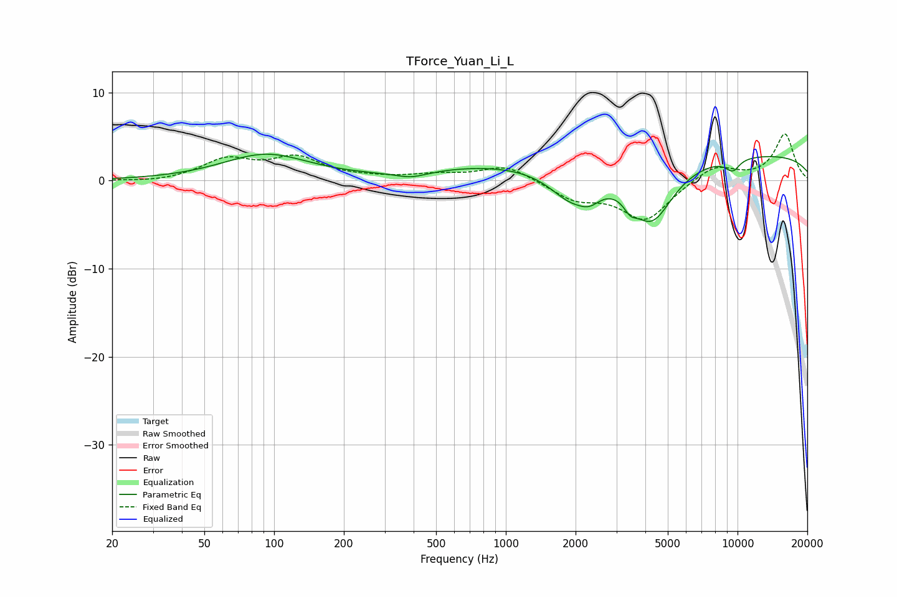

# TForce_Yuan_Li_L
See [usage instructions](https://github.com/jaakkopasanen/AutoEq#usage) for more options and info.

### Parametric EQs
Apply preamp of -3.1 dB when using parametric equalizer.

|   # | Type    |   Fc (Hz) |    Q |   Gain (dB) |
|-----|---------|-----------|------|-------------|
|   1 | Peaking |        92 | 0.76 |         2.9 |
|   2 | Peaking |       390 | 2.01 |        -0.7 |
|   3 | Peaking |       856 | 0.49 |         1.5 |
|   4 | Peaking |      1897 | 1.53 |        -3.2 |
|   5 | Peaking |      2299 | 2.87 |        -1.5 |
|   6 | Peaking |      3443 | 5.07 |        -1.2 |
|   7 | Peaking |      4260 | 1.49 |        -6.7 |
|   8 | Peaking |      9037 | 4.3  |        -0.1 |
|   9 | Peaking |      9568 | 4.28 |        -1.2 |
|  10 | Peaking |     10000 | 0.18 |         3.1 |

### Fixed Band EQs
When using fixed band (also called graphic) equalizer, apply preamp of **-5.4 dB** (if available) and set gains manually with these parameters.

|   # | Type    |   Fc (Hz) |    Q |   Gain (dB) |
|-----|---------|-----------|------|-------------|
|   1 | Peaking |        31 | 1.41 |        -0.2 |
|   2 | Peaking |        62 | 1.41 |         2.3 |
|   3 | Peaking |       125 | 1.41 |         2.4 |
|   4 | Peaking |       250 | 1.41 |         0.2 |
|   5 | Peaking |       500 | 1.41 |         0.6 |
|   6 | Peaking |      1000 | 1.41 |         1.8 |
|   7 | Peaking |      2000 | 1.41 |        -2   |
|   8 | Peaking |      4000 | 1.41 |        -4.4 |
|   9 | Peaking |      8000 | 1.41 |         1.8 |
|  10 | Peaking |     16000 | 1.41 |         5.3 |

### Graphs

