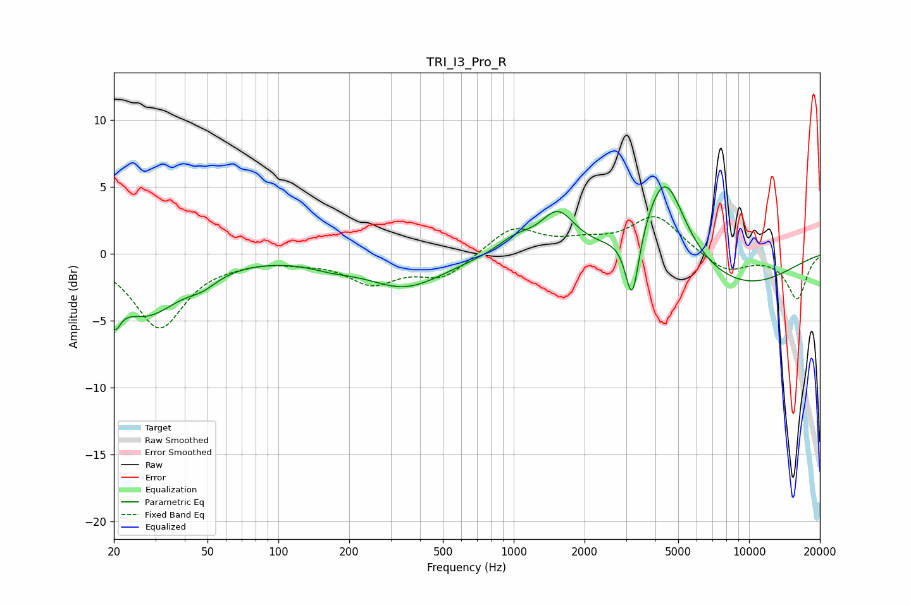

# TRI_I3_Pro_R
See [usage instructions](https://github.com/jaakkopasanen/AutoEq#usage) for more options and info.

### Parametric EQs
Apply preamp of -5.1 dB when using parametric equalizer.

|   # | Type    |   Fc (Hz) |    Q |   Gain (dB) |
|-----|---------|-----------|------|-------------|
|   1 | Peaking |        20 | 5.11 |        -2.5 |
|   2 | Peaking |        27 | 0.96 |        -4.3 |
|   3 | Peaking |        48 | 2.15 |        -0.8 |
|   4 | Peaking |       168 | 1.53 |        -0.4 |
|   5 | Peaking |       346 | 0.85 |        -2.4 |
|   6 | Peaking |      1014 | 1.79 |         1.1 |
|   7 | Peaking |      1540 | 1.93 |         2.9 |
|   8 | Peaking |      3189 | 4.94 |        -5.2 |
|   9 | Peaking |      4382 | 1.64 |         6.6 |
|  10 | Peaking |      9086 | 0.52 |        -2.5 |

### Fixed Band EQs
When using fixed band (also called graphic) equalizer, apply preamp of **-2.9 dB** (if available) and set gains manually with these parameters.

|   # | Type    |   Fc (Hz) |    Q |   Gain (dB) |
|-----|---------|-----------|------|-------------|
|   1 | Peaking |        31 | 1.41 |        -5.4 |
|   2 | Peaking |        62 | 1.41 |        -0.3 |
|   3 | Peaking |       125 | 1.41 |        -0.3 |
|   4 | Peaking |       250 | 1.41 |        -2   |
|   5 | Peaking |       500 | 1.41 |        -1.7 |
|   6 | Peaking |      1000 | 1.41 |         2   |
|   7 | Peaking |      2000 | 1.41 |         0.7 |
|   8 | Peaking |      4000 | 1.41 |         2.8 |
|   9 | Peaking |      8000 | 1.41 |        -1.4 |
|  10 | Peaking |     16000 | 1.41 |        -3.3 |

### Graphs

