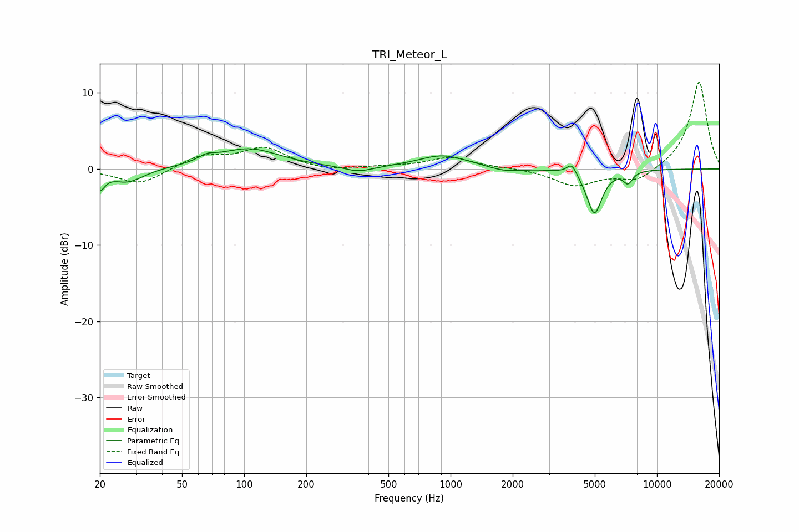

# TRI_Meteor_L
See [usage instructions](https://github.com/jaakkopasanen/AutoEq#usage) for more options and info.

### Parametric EQs
Apply preamp of -2.7 dB when using parametric equalizer.

|   # | Type    |   Fc (Hz) |    Q |   Gain (dB) |
|-----|---------|-----------|------|-------------|
|   1 | Peaking |        20 | 5.98 |        -2.2 |
|   2 | Peaking |        27 | 1.82 |        -1.8 |
|   3 | Peaking |        66 | 3.4  |         0.7 |
|   4 | Peaking |       105 | 0.93 |         2.6 |
|   5 | Peaking |       358 | 2.06 |        -0.7 |
|   6 | Peaking |       919 | 1.15 |         1.8 |
|   7 | Peaking |      1833 | 1.87 |        -0.6 |
|   8 | Peaking |      3868 | 6    |         1.5 |
|   9 | Peaking |      4977 | 3.77 |        -5.9 |
|  10 | Peaking |      7246 | 6    |        -1.5 |

### Fixed Band EQs
When using fixed band (also called graphic) equalizer, apply preamp of **-11.5 dB** (if available) and set gains manually with these parameters.

|   # | Type    |   Fc (Hz) |    Q |   Gain (dB) |
|-----|---------|-----------|------|-------------|
|   1 | Peaking |        31 | 1.41 |        -2.1 |
|   2 | Peaking |        62 | 1.41 |         1.7 |
|   3 | Peaking |       125 | 1.41 |         2.7 |
|   4 | Peaking |       250 | 1.41 |        -0.4 |
|   5 | Peaking |       500 | 1.41 |         0.2 |
|   6 | Peaking |      1000 | 1.41 |         1.5 |
|   7 | Peaking |      2000 | 1.41 |         0.1 |
|   8 | Peaking |      4000 | 1.41 |        -2.2 |
|   9 | Peaking |      8000 | 1.41 |        -1.7 |
|  10 | Peaking |     16000 | 1.41 |        11.5 |

### Graphs

