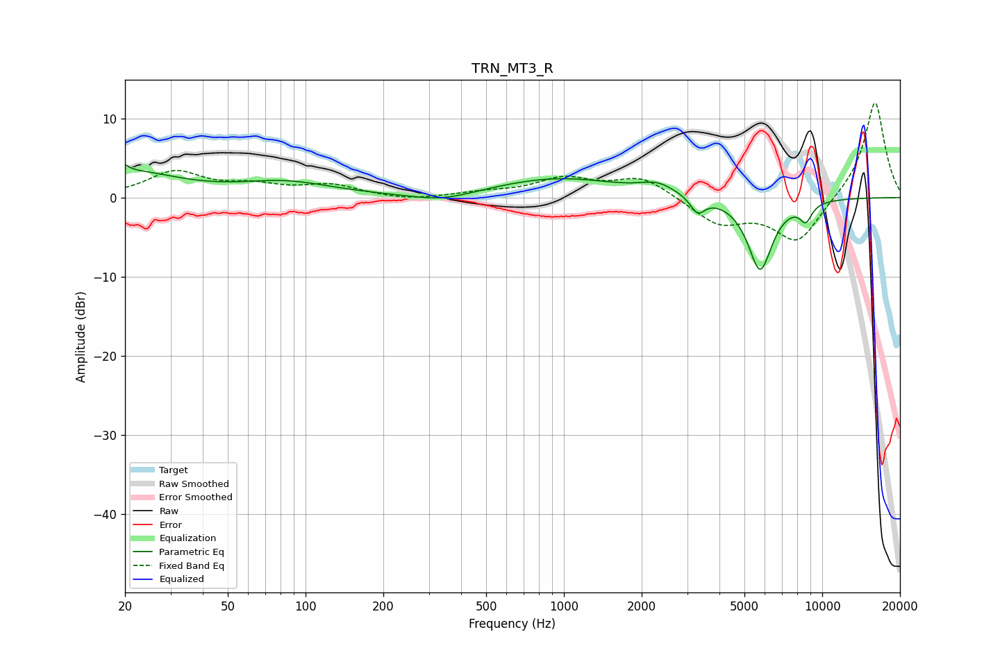

# TRN_MT3_R
See [usage instructions](https://github.com/jaakkopasanen/AutoEq#usage) for more options and info.

### Parametric EQs
Apply preamp of -4.2 dB when using parametric equalizer.

|   # | Type    |   Fc (Hz) |    Q |   Gain (dB) |
|-----|---------|-----------|------|-------------|
|   1 | Peaking |        20 | 5.9  |         3.2 |
|   2 | Peaking |        20 | 5.99 |        -2.2 |
|   3 | Peaking |        21 | 0.79 |         3   |
|   4 | Peaking |        84 | 0.77 |         1.8 |
|   5 | Peaking |       339 | 1.18 |        -1   |
|   6 | Peaking |       946 | 0.57 |         2.4 |
|   7 | Peaking |      2304 | 2.14 |         1.2 |
|   8 | Peaking |      3292 | 5.02 |        -2.1 |
|   9 | Peaking |      5747 | 2.86 |        -9.2 |
|  10 | Peaking |      8639 | 5.43 |        -2.2 |

### Fixed Band EQs
When using fixed band (also called graphic) equalizer, apply preamp of **-12.0 dB** (if available) and set gains manually with these parameters.

|   # | Type    |   Fc (Hz) |    Q |   Gain (dB) |
|-----|---------|-----------|------|-------------|
|   1 | Peaking |        31 | 1.41 |         3.1 |
|   2 | Peaking |        62 | 1.41 |         1.3 |
|   3 | Peaking |       125 | 1.41 |         1.4 |
|   4 | Peaking |       250 | 1.41 |        -0.4 |
|   5 | Peaking |       500 | 1.41 |         0.5 |
|   6 | Peaking |      1000 | 1.41 |         2.3 |
|   7 | Peaking |      2000 | 1.41 |         2.6 |
|   8 | Peaking |      4000 | 1.41 |        -3.2 |
|   9 | Peaking |      8000 | 1.41 |        -5.7 |
|  10 | Peaking |     16000 | 1.41 |        12.3 |

### Graphs

