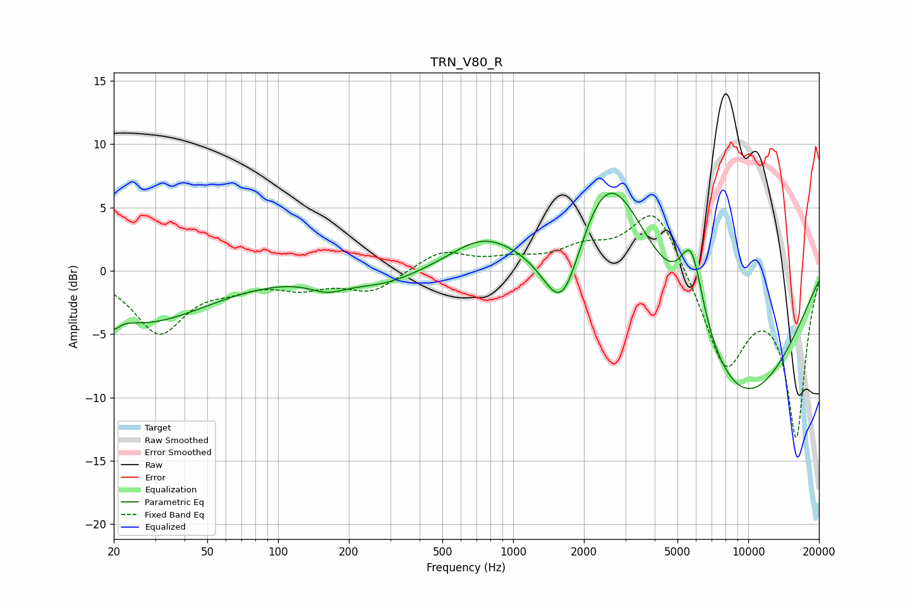

# TRN_V80_R
See [usage instructions](https://github.com/jaakkopasanen/AutoEq#usage) for more options and info.

### Parametric EQs
Apply preamp of -6.2 dB when using parametric equalizer.

|   # | Type    |   Fc (Hz) |    Q |   Gain (dB) |
|-----|---------|-----------|------|-------------|
|   1 | Peaking |        20 | 5.83 |        -1.1 |
|   2 | Peaking |        24 | 0.72 |        -2.9 |
|   3 | Peaking |        41 | 0.6  |        -1.5 |
|   4 | Peaking |       162 | 1.87 |        -0.9 |
|   5 | Peaking |       277 | 0.88 |        -1.1 |
|   6 | Peaking |       737 | 1.04 |         2   |
|   7 | Peaking |      1620 | 1.55 |        -7.8 |
|   8 | Peaking |      2536 | 0.77 |        11.3 |
|   9 | Peaking |      5734 | 2.68 |         6.4 |
|  10 | Peaking |      9068 | 0.43 |       -10.9 |

### Fixed Band EQs
When using fixed band (also called graphic) equalizer, apply preamp of **-4.4 dB** (if available) and set gains manually with these parameters.

|   # | Type    |   Fc (Hz) |    Q |   Gain (dB) |
|-----|---------|-----------|------|-------------|
|   1 | Peaking |        31 | 1.41 |        -4.8 |
|   2 | Peaking |        62 | 1.41 |        -0.9 |
|   3 | Peaking |       125 | 1.41 |        -1.1 |
|   4 | Peaking |       250 | 1.41 |        -1.6 |
|   5 | Peaking |       500 | 1.41 |         1.5 |
|   6 | Peaking |      1000 | 1.41 |         0.7 |
|   7 | Peaking |      2000 | 1.41 |         1.5 |
|   8 | Peaking |      4000 | 1.41 |         5.3 |
|   9 | Peaking |      8000 | 1.41 |        -7.5 |
|  10 | Peaking |     16000 | 1.41 |       -12.9 |

### Graphs

