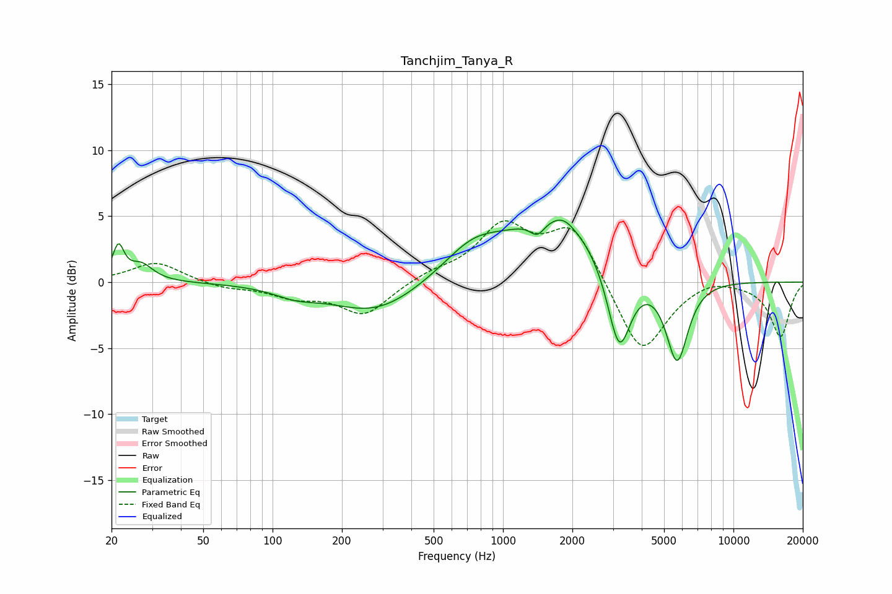

# Tanchjim_Tanya_R
See [usage instructions](https://github.com/jaakkopasanen/AutoEq#usage) for more options and info.

### Parametric EQs
Apply preamp of -4.8 dB when using parametric equalizer.

|   # | Type    |   Fc (Hz) |    Q |   Gain (dB) |
|-----|---------|-----------|------|-------------|
|   1 | Peaking |        21 | 5.9  |         2.5 |
|   2 | Peaking |        27 | 2.8  |         1.3 |
|   3 | Peaking |       126 | 1.5  |        -0.7 |
|   4 | Peaking |       280 | 0.74 |        -2.4 |
|   5 | Peaking |       739 | 1.09 |         2.2 |
|   6 | Peaking |      1410 | 4.42 |        -1.1 |
|   7 | Peaking |      1738 | 0.65 |         4.8 |
|   8 | Peaking |      1828 | 3.07 |         0.6 |
|   9 | Peaking |      3191 | 2.69 |        -6.9 |
|  10 | Peaking |      5694 | 2.86 |        -6.3 |

### Fixed Band EQs
When using fixed band (also called graphic) equalizer, apply preamp of **-4.7 dB** (if available) and set gains manually with these parameters.

|   # | Type    |   Fc (Hz) |    Q |   Gain (dB) |
|-----|---------|-----------|------|-------------|
|   1 | Peaking |        31 | 1.41 |         1.5 |
|   2 | Peaking |        62 | 1.41 |        -0.4 |
|   3 | Peaking |       125 | 1.41 |        -1   |
|   4 | Peaking |       250 | 1.41 |        -2.5 |
|   5 | Peaking |       500 | 1.41 |         0.6 |
|   6 | Peaking |      1000 | 1.41 |         4   |
|   7 | Peaking |      2000 | 1.41 |         4.2 |
|   8 | Peaking |      4000 | 1.41 |        -5.7 |
|   9 | Peaking |      8000 | 1.41 |         0.5 |
|  10 | Peaking |     16000 | 1.41 |        -4.1 |

### Graphs

