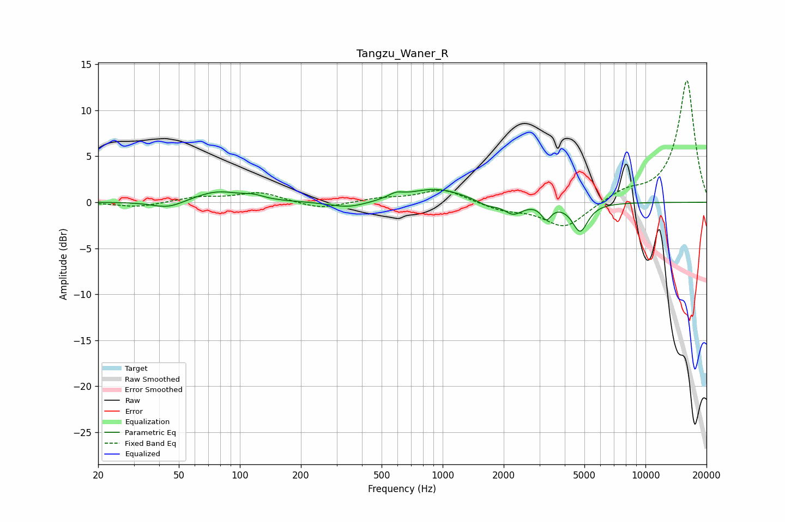

# Tangzu_Waner_R
See [usage instructions](https://github.com/jaakkopasanen/AutoEq#usage) for more options and info.

### Parametric EQs
Apply preamp of -1.5 dB when using parametric equalizer.

|   # | Type    |   Fc (Hz) |    Q |   Gain (dB) |
|-----|---------|-----------|------|-------------|
|   1 | Peaking |        44 | 1.82 |        -0.8 |
|   2 | Peaking |        77 | 1.25 |         1.2 |
|   3 | Peaking |       117 | 2.83 |         0.4 |
|   4 | Peaking |       343 | 1.54 |        -0.7 |
|   5 | Peaking |       586 | 3.89 |         0.5 |
|   6 | Peaking |       926 | 1.04 |         1.5 |
|   7 | Peaking |      1658 | 2.82 |        -0.6 |
|   8 | Peaking |      2229 | 3.15 |        -1.3 |
|   9 | Peaking |      3243 | 5.97 |        -1.5 |
|  10 | Peaking |      4763 | 3.67 |        -3.1 |

### Fixed Band EQs
When using fixed band (also called graphic) equalizer, apply preamp of **-13.3 dB** (if available) and set gains manually with these parameters.

|   # | Type    |   Fc (Hz) |    Q |   Gain (dB) |
|-----|---------|-----------|------|-------------|
|   1 | Peaking |        31 | 1.41 |        -0.5 |
|   2 | Peaking |        62 | 1.41 |         0.5 |
|   3 | Peaking |       125 | 1.41 |         1.1 |
|   4 | Peaking |       250 | 1.41 |        -0.8 |
|   5 | Peaking |       500 | 1.41 |         0.4 |
|   6 | Peaking |      1000 | 1.41 |         1.4 |
|   7 | Peaking |      2000 | 1.41 |        -0.8 |
|   8 | Peaking |      4000 | 1.41 |        -2.8 |
|   9 | Peaking |      8000 | 1.41 |         1.1 |
|  10 | Peaking |     16000 | 1.41 |        13.3 |

### Graphs

