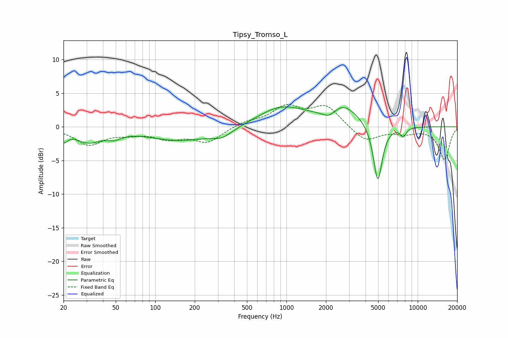

# Tipsy_Tromso_L
See [usage instructions](https://github.com/jaakkopasanen/AutoEq#usage) for more options and info.

### Parametric EQs
Apply preamp of -3.1 dB when using parametric equalizer.

|   # | Type    |   Fc (Hz) |    Q |   Gain (dB) |
|-----|---------|-----------|------|-------------|
|   1 | Peaking |        20 | 4.44 |        -1.5 |
|   2 | Peaking |        31 | 1.49 |        -2   |
|   3 | Peaking |        49 | 2.47 |        -0.9 |
|   4 | Peaking |       155 | 0.58 |        -2   |
|   5 | Peaking |       323 | 1.76 |        -1.2 |
|   6 | Peaking |       918 | 0.79 |         2.9 |
|   7 | Peaking |      2127 | 2.43 |        -1.6 |
|   8 | Peaking |      2628 | 1.15 |         3.3 |
|   9 | Peaking |      4968 | 4.06 |        -8.7 |
|  10 | Peaking |      7765 | 5.77 |        -1.3 |

### Fixed Band EQs
When using fixed band (also called graphic) equalizer, apply preamp of **-3.4 dB** (if available) and set gains manually with these parameters.

|   # | Type    |   Fc (Hz) |    Q |   Gain (dB) |
|-----|---------|-----------|------|-------------|
|   1 | Peaking |        31 | 1.41 |        -2.6 |
|   2 | Peaking |        62 | 1.41 |        -0.7 |
|   3 | Peaking |       125 | 1.41 |        -1.5 |
|   4 | Peaking |       250 | 1.41 |        -2.2 |
|   5 | Peaking |       500 | 1.41 |         0.7 |
|   6 | Peaking |      1000 | 1.41 |         2.8 |
|   7 | Peaking |      2000 | 1.41 |         3   |
|   8 | Peaking |      4000 | 1.41 |        -2.2 |
|   9 | Peaking |      8000 | 1.41 |        -0.8 |
|  10 | Peaking |     16000 | 1.41 |        -4.8 |

### Graphs

