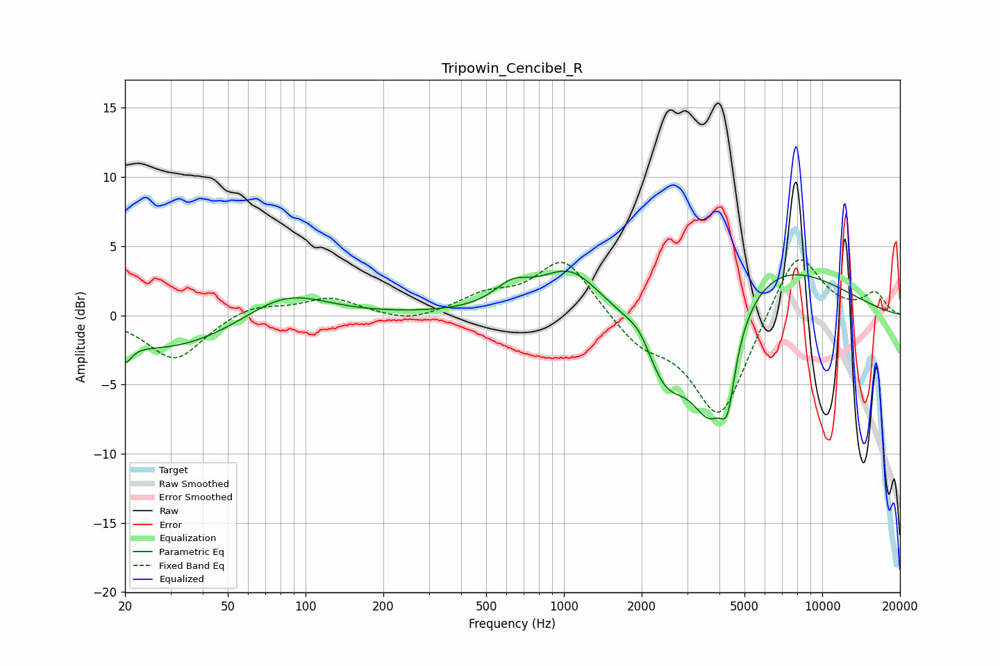

# Tripowin_Cencibel_R
See [usage instructions](https://github.com/jaakkopasanen/AutoEq#usage) for more options and info.

### Parametric EQs
Apply preamp of -3.3 dB when using parametric equalizer.

|   # | Type    |   Fc (Hz) |    Q |   Gain (dB) |
|-----|---------|-----------|------|-------------|
|   1 | Peaking |        20 | 5.65 |        -1.4 |
|   2 | Peaking |        29 | 0.53 |        -2.5 |
|   3 | Peaking |        83 | 0.9  |         2.1 |
|   4 | Peaking |       631 | 1.99 |         1.5 |
|   5 | Peaking |      1054 | 1.21 |         3.1 |
|   6 | Peaking |      1979 | 2.72 |         1.4 |
|   7 | Peaking |      2453 | 1.46 |        -5.7 |
|   8 | Peaking |      3705 | 1.61 |        -8.7 |
|   9 | Peaking |      4303 | 5.24 |        -3.7 |
|  10 | Peaking |      5517 | 0.46 |         4.8 |

### Fixed Band EQs
When using fixed band (also called graphic) equalizer, apply preamp of **-4.1 dB** (if available) and set gains manually with these parameters.

|   # | Type    |   Fc (Hz) |    Q |   Gain (dB) |
|-----|---------|-----------|------|-------------|
|   1 | Peaking |        31 | 1.41 |        -3.2 |
|   2 | Peaking |        62 | 1.41 |         0.8 |
|   3 | Peaking |       125 | 1.41 |         1.2 |
|   4 | Peaking |       250 | 1.41 |        -0.6 |
|   5 | Peaking |       500 | 1.41 |         1.3 |
|   6 | Peaking |      1000 | 1.41 |         4.2 |
|   7 | Peaking |      2000 | 1.41 |        -1.9 |
|   8 | Peaking |      4000 | 1.41 |        -7.6 |
|   9 | Peaking |      8000 | 1.41 |         5.1 |
|  10 | Peaking |     16000 | 1.41 |         1.5 |

### Graphs

