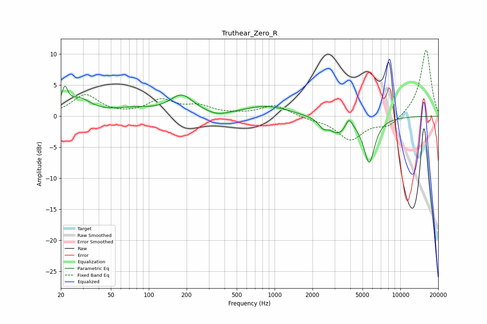

# Truthear_Zero_R
See [usage instructions](https://github.com/jaakkopasanen/AutoEq#usage) for more options and info.

### Parametric EQs
Apply preamp of -5.0 dB when using parametric equalizer.

|   # | Type    |   Fc (Hz) |    Q |   Gain (dB) |
|-----|---------|-----------|------|-------------|
|   1 | Peaking |        21 | 5.97 |         3.2 |
|   2 | Peaking |        28 | 1.54 |         2.5 |
|   3 | Peaking |        75 | 0.85 |         1   |
|   4 | Peaking |       182 | 1.5  |         3.1 |
|   5 | Peaking |       351 | 1.88 |        -0.6 |
|   6 | Peaking |       866 | 0.82 |         1.6 |
|   7 | Peaking |      2427 | 4.1  |        -1.1 |
|   8 | Peaking |      3216 | 1.87 |        -2.6 |
|   9 | Peaking |      3902 | 4.99 |         1.9 |
|  10 | Peaking |      5652 | 3.16 |        -7.2 |

### Fixed Band EQs
When using fixed band (also called graphic) equalizer, apply preamp of **-10.7 dB** (if available) and set gains manually with these parameters.

|   # | Type    |   Fc (Hz) |    Q |   Gain (dB) |
|-----|---------|-----------|------|-------------|
|   1 | Peaking |        31 | 1.41 |         3.4 |
|   2 | Peaking |        62 | 1.41 |         0.1 |
|   3 | Peaking |       125 | 1.41 |         2.4 |
|   4 | Peaking |       250 | 1.41 |         1.4 |
|   5 | Peaking |       500 | 1.41 |         0.2 |
|   6 | Peaking |      1000 | 1.41 |         1.8 |
|   7 | Peaking |      2000 | 1.41 |        -0.4 |
|   8 | Peaking |      4000 | 1.41 |        -3.7 |
|   9 | Peaking |      8000 | 1.41 |        -1.6 |
|  10 | Peaking |     16000 | 1.41 |        10.8 |

### Graphs

