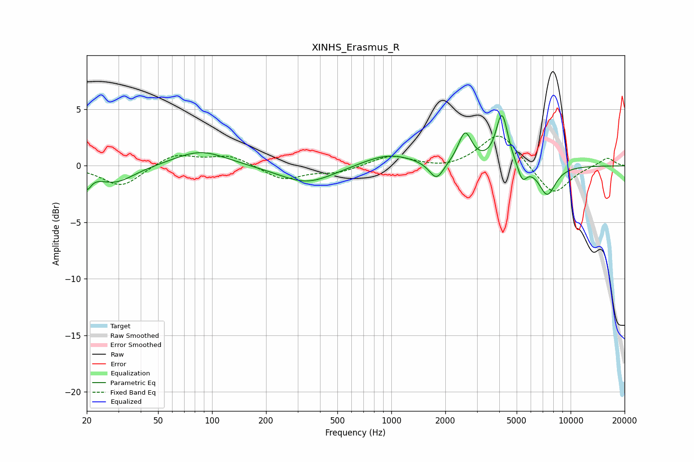

# XINHS_Erasmus_R
See [usage instructions](https://github.com/jaakkopasanen/AutoEq#usage) for more options and info.

### Parametric EQs
Apply preamp of -4.6 dB when using parametric equalizer.

|   # | Type    |   Fc (Hz) |    Q |   Gain (dB) |
|-----|---------|-----------|------|-------------|
|   1 | Peaking |        20 | 5.94 |        -1.4 |
|   2 | Peaking |        29 | 1.3  |        -1.5 |
|   3 | Peaking |        86 | 0.97 |         1.4 |
|   4 | Peaking |       338 | 0.93 |        -1.6 |
|   5 | Peaking |       962 | 0.98 |         1.1 |
|   6 | Peaking |      1786 | 3.51 |        -1.6 |
|   7 | Peaking |      2577 | 3.84 |         2.8 |
|   8 | Peaking |      4141 | 4.25 |         4.6 |
|   9 | Peaking |      5377 | 5.47 |        -1.4 |
|  10 | Peaking |      7406 | 2.84 |        -2.6 |

### Fixed Band EQs
When using fixed band (also called graphic) equalizer, apply preamp of **-2.7 dB** (if available) and set gains manually with these parameters.

|   # | Type    |   Fc (Hz) |    Q |   Gain (dB) |
|-----|---------|-----------|------|-------------|
|   1 | Peaking |        31 | 1.41 |        -1.9 |
|   2 | Peaking |        62 | 1.41 |         1.1 |
|   3 | Peaking |       125 | 1.41 |         0.9 |
|   4 | Peaking |       250 | 1.41 |        -1.2 |
|   5 | Peaking |       500 | 1.41 |        -0.6 |
|   6 | Peaking |      1000 | 1.41 |         0.9 |
|   7 | Peaking |      2000 | 1.41 |        -0.3 |
|   8 | Peaking |      4000 | 1.41 |         3   |
|   9 | Peaking |      8000 | 1.41 |        -2.7 |
|  10 | Peaking |     16000 | 1.41 |         0.8 |

### Graphs

