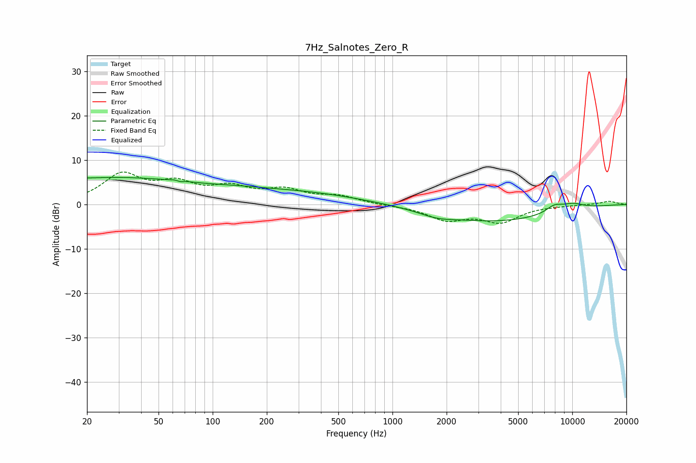

# 7Hz_Salnotes_Zero_R
See [usage instructions](https://github.com/jaakkopasanen/AutoEq#usage) for more options and info.

### Parametric EQs
Apply preamp of -6.2 dB when using parametric equalizer.

|   # | Type    |   Fc (Hz) |    Q |   Gain (dB) |
|-----|---------|-----------|------|-------------|
|   1 | Peaking |        22 | 1.51 |        -0.2 |
|   2 | Peaking |        23 | 0.24 |         6.1 |
|   3 | Peaking |        65 | 5.39 |         3.4 |
|   4 | Peaking |        65 | 5.83 |        -3.5 |
|   5 | Peaking |       136 | 0.74 |         0.6 |
|   6 | Peaking |       309 | 0.42 |         2.4 |
|   7 | Peaking |      1775 | 1.45 |        -1.1 |
|   8 | Peaking |      3775 | 0.42 |        -3.7 |
|   9 | Peaking |      7939 | 2.85 |         1.5 |
|  10 | Peaking |     10000 | 1.81 |         1.4 |

### Fixed Band EQs
When using fixed band (also called graphic) equalizer, apply preamp of **-7.4 dB** (if available) and set gains manually with these parameters.

|   # | Type    |   Fc (Hz) |    Q |   Gain (dB) |
|-----|---------|-----------|------|-------------|
|   1 | Peaking |        31 | 1.41 |         6.4 |
|   2 | Peaking |        62 | 1.41 |         4   |
|   3 | Peaking |       125 | 1.41 |         3.2 |
|   4 | Peaking |       250 | 1.41 |         2.8 |
|   5 | Peaking |       500 | 1.41 |         1.7 |
|   6 | Peaking |      1000 | 1.41 |        -0.2 |
|   7 | Peaking |      2000 | 1.41 |        -3.2 |
|   8 | Peaking |      4000 | 1.41 |        -3.7 |
|   9 | Peaking |      8000 | 1.41 |        -0.2 |
|  10 | Peaking |     16000 | 1.41 |         0.7 |

### Graphs

