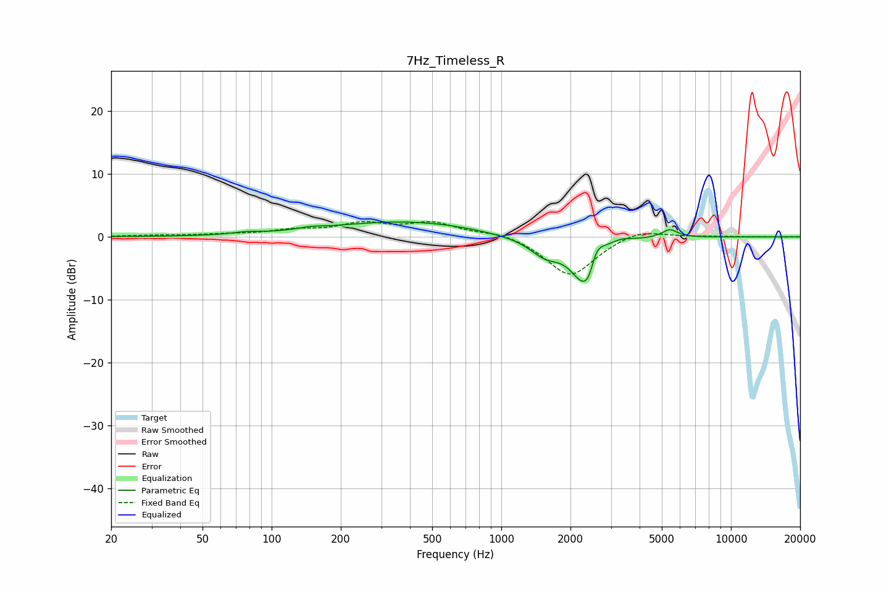

# 7Hz_Timeless_R
See [usage instructions](https://github.com/jaakkopasanen/AutoEq#usage) for more options and info.

### Parametric EQs
Apply preamp of -2.5 dB when using parametric equalizer.

|   # | Type    |   Fc (Hz) |    Q |   Gain (dB) |
|-----|---------|-----------|------|-------------|
|   1 | Peaking |        77 | 2.42 |         0.3 |
|   2 | Peaking |       148 | 2.82 |         0.3 |
|   3 | Peaking |       391 | 0.41 |         2.5 |
|   4 | Peaking |       982 | 0.93 |        -0.4 |
|   5 | Peaking |      1552 | 2.05 |        -2.7 |
|   6 | Peaking |      2291 | 2.43 |        -7.4 |
|   7 | Peaking |      2419 | 6    |        -2.2 |
|   8 | Peaking |      2561 | 4.04 |         3.9 |
|   9 | Peaking |      3288 | 2.88 |         0.7 |
|  10 | Peaking |      5415 | 4.13 |         1.3 |

### Fixed Band EQs
When using fixed band (also called graphic) equalizer, apply preamp of **-2.5 dB** (if available) and set gains manually with these parameters.

|   # | Type    |   Fc (Hz) |    Q |   Gain (dB) |
|-----|---------|-----------|------|-------------|
|   1 | Peaking |        31 | 1.41 |         0.2 |
|   2 | Peaking |        62 | 1.41 |         0.3 |
|   3 | Peaking |       125 | 1.41 |         0.9 |
|   4 | Peaking |       250 | 1.41 |         1.9 |
|   5 | Peaking |       500 | 1.41 |         2.1 |
|   6 | Peaking |      1000 | 1.41 |         0.9 |
|   7 | Peaking |      2000 | 1.41 |        -6.4 |
|   8 | Peaking |      4000 | 1.41 |         1.5 |
|   9 | Peaking |      8000 | 1.41 |         0.1 |
|  10 | Peaking |     16000 | 1.41 |        -0   |

### Graphs

