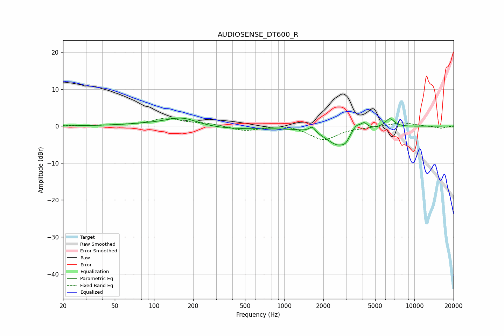

# AUDIOSENSE_DT600_R
See [usage instructions](https://github.com/jaakkopasanen/AutoEq#usage) for more options and info.

### Parametric EQs
Apply preamp of -2.3 dB when using parametric equalizer.

|   # | Type    |   Fc (Hz) |    Q |   Gain (dB) |
|-----|---------|-----------|------|-------------|
|   1 | Peaking |        91 | 0.71 |         0.5 |
|   2 | Peaking |       164 | 1.17 |         2.5 |
|   3 | Peaking |       354 | 0.42 |        -0.9 |
|   4 | Peaking |      1645 | 6    |         1.6 |
|   5 | Peaking |      2574 | 3.26 |        -0.2 |
|   6 | Peaking |      2634 | 1.37 |        -5   |
|   7 | Peaking |      2957 | 5.7  |        -0.9 |
|   8 | Peaking |      3562 | 3.54 |         2.6 |
|   9 | Peaking |      4127 | 6    |         1.5 |
|  10 | Peaking |      6472 | 3.98 |         2.4 |

### Fixed Band EQs
When using fixed band (also called graphic) equalizer, apply preamp of **-2.3 dB** (if available) and set gains manually with these parameters.

|   # | Type    |   Fc (Hz) |    Q |   Gain (dB) |
|-----|---------|-----------|------|-------------|
|   1 | Peaking |        31 | 1.41 |         0.1 |
|   2 | Peaking |        62 | 1.41 |         0.2 |
|   3 | Peaking |       125 | 1.41 |         2.1 |
|   4 | Peaking |       250 | 1.41 |         0.7 |
|   5 | Peaking |       500 | 1.41 |        -1.3 |
|   6 | Peaking |      1000 | 1.41 |         0.6 |
|   7 | Peaking |      2000 | 1.41 |        -3.7 |
|   8 | Peaking |      4000 | 1.41 |        -0.2 |
|   9 | Peaking |      8000 | 1.41 |         1   |
|  10 | Peaking |     16000 | 1.41 |        -0.6 |

### Graphs

