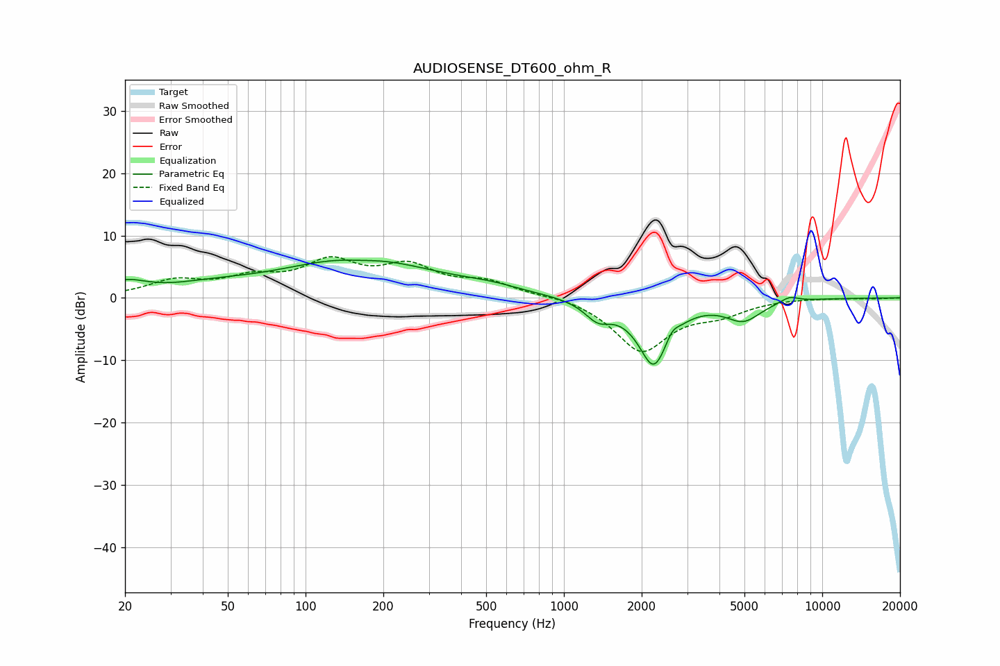

# AUDIOSENSE_DT600_ohm_R
See [usage instructions](https://github.com/jaakkopasanen/AutoEq#usage) for more options and info.

### Parametric EQs
Apply preamp of -6.1 dB when using parametric equalizer.

|   # | Type    |   Fc (Hz) |    Q |   Gain (dB) |
|-----|---------|-----------|------|-------------|
|   1 | Peaking |        20 | 1.72 |         2.1 |
|   2 | Peaking |        43 | 0.85 |         1.2 |
|   3 | Peaking |       161 | 0.48 |         6.3 |
|   4 | Peaking |       163 | 1.76 |        -0.4 |
|   5 | Peaking |       518 | 1.27 |         0.8 |
|   6 | Peaking |      1353 | 2.8  |        -2.7 |
|   7 | Peaking |      2227 | 2.29 |       -10.6 |
|   8 | Peaking |      2623 | 6    |         1.4 |
|   9 | Peaking |      4952 | 2.03 |        -3.2 |
|  10 | Peaking |      7456 | 3.89 |         0.9 |

### Fixed Band EQs
When using fixed band (also called graphic) equalizer, apply preamp of **-6.7 dB** (if available) and set gains manually with these parameters.

|   # | Type    |   Fc (Hz) |    Q |   Gain (dB) |
|-----|---------|-----------|------|-------------|
|   1 | Peaking |        31 | 1.41 |         2.5 |
|   2 | Peaking |        62 | 1.41 |         2.6 |
|   3 | Peaking |       125 | 1.41 |         5.1 |
|   4 | Peaking |       250 | 1.41 |         4.4 |
|   5 | Peaking |       500 | 1.41 |         2.3 |
|   6 | Peaking |      1000 | 1.41 |         0.5 |
|   7 | Peaking |      2000 | 1.41 |        -8.5 |
|   8 | Peaking |      4000 | 1.41 |        -2   |
|   9 | Peaking |      8000 | 1.41 |         0.1 |
|  10 | Peaking |     16000 | 1.41 |        -0.1 |

### Graphs

