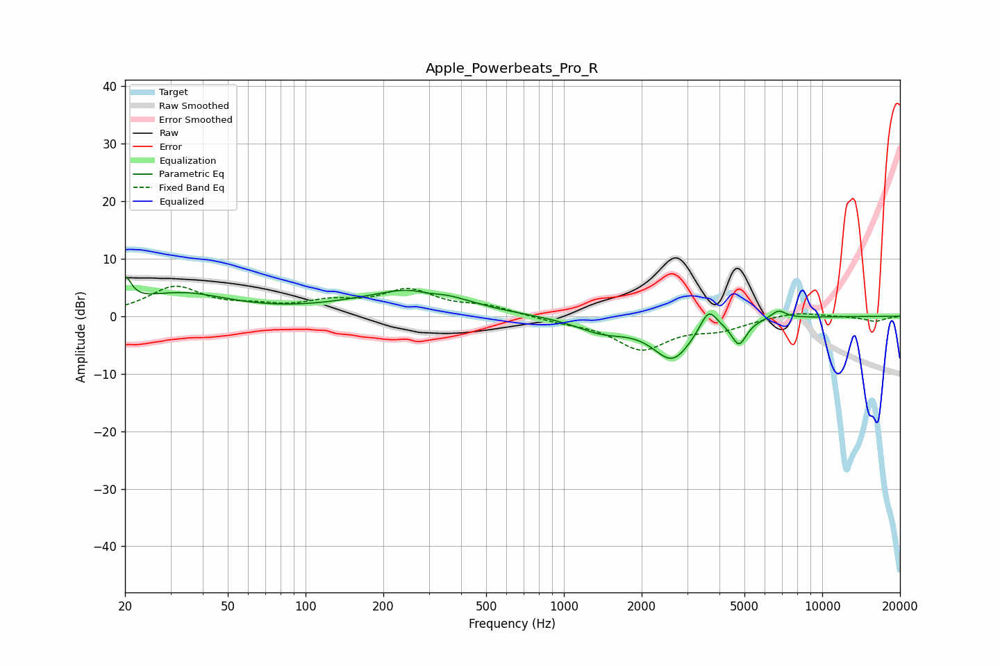

# Apple_Powerbeats_Pro_R
See [usage instructions](https://github.com/jaakkopasanen/AutoEq#usage) for more options and info.

### Parametric EQs
Apply preamp of -7.0 dB when using parametric equalizer.

|   # | Type    |   Fc (Hz) |    Q |   Gain (dB) |
|-----|---------|-----------|------|-------------|
|   1 | Peaking |        20 | 6    |         4.4 |
|   2 | Peaking |        33 | 0.76 |         3.8 |
|   3 | Peaking |       174 | 0.66 |         1.5 |
|   4 | Peaking |       289 | 0.99 |         4.4 |
|   5 | Peaking |       297 | 2.33 |        -1.3 |
|   6 | Peaking |      1404 | 1.36 |        -2.4 |
|   7 | Peaking |      2631 | 1.8  |        -7.2 |
|   8 | Peaking |      3629 | 4.27 |         3.9 |
|   9 | Peaking |      4763 | 4.81 |        -4.2 |
|  10 | Peaking |      6769 | 4.62 |         1.5 |

### Fixed Band EQs
When using fixed band (also called graphic) equalizer, apply preamp of **-5.3 dB** (if available) and set gains manually with these parameters.

|   # | Type    |   Fc (Hz) |    Q |   Gain (dB) |
|-----|---------|-----------|------|-------------|
|   1 | Peaking |        31 | 1.41 |         4.9 |
|   2 | Peaking |        62 | 1.41 |         1.2 |
|   3 | Peaking |       125 | 1.41 |         2   |
|   4 | Peaking |       250 | 1.41 |         4.2 |
|   5 | Peaking |       500 | 1.41 |         1.5 |
|   6 | Peaking |      1000 | 1.41 |        -0.8 |
|   7 | Peaking |      2000 | 1.41 |        -5.5 |
|   8 | Peaking |      4000 | 1.41 |        -1.9 |
|   9 | Peaking |      8000 | 1.41 |         0.9 |
|  10 | Peaking |     16000 | 1.41 |        -0.9 |

### Graphs

