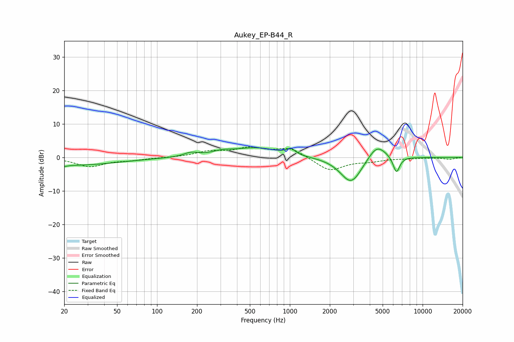

# Aukey_EP-B44_R
See [usage instructions](https://github.com/jaakkopasanen/AutoEq#usage) for more options and info.

### Parametric EQs
Apply preamp of -3.0 dB when using parametric equalizer.

|   # | Type    |   Fc (Hz) |    Q |   Gain (dB) |
|-----|---------|-----------|------|-------------|
|   1 | Peaking |        20 | 5.63 |        -0.4 |
|   2 | Peaking |        23 | 0.41 |        -2.3 |
|   3 | Peaking |       180 | 2.67 |         1.1 |
|   4 | Peaking |       308 | 2.01 |         1   |
|   5 | Peaking |       558 | 0.81 |         2.8 |
|   6 | Peaking |      1019 | 4.54 |         1.7 |
|   7 | Peaking |      2711 | 2.17 |        -1.1 |
|   8 | Peaking |      2940 | 1.7  |        -7   |
|   9 | Peaking |      4520 | 1.96 |         4.8 |
|  10 | Peaking |      6348 | 5.4  |        -5   |

### Fixed Band EQs
When using fixed band (also called graphic) equalizer, apply preamp of **-3.2 dB** (if available) and set gains manually with these parameters.

|   # | Type    |   Fc (Hz) |    Q |   Gain (dB) |
|-----|---------|-----------|------|-------------|
|   1 | Peaking |        31 | 1.41 |        -2.7 |
|   2 | Peaking |        62 | 1.41 |        -0.7 |
|   3 | Peaking |       125 | 1.41 |        -0.1 |
|   4 | Peaking |       250 | 1.41 |         1.6 |
|   5 | Peaking |       500 | 1.41 |         2.5 |
|   6 | Peaking |      1000 | 1.41 |         2.8 |
|   7 | Peaking |      2000 | 1.41 |        -4   |
|   8 | Peaking |      4000 | 1.41 |        -0.9 |
|   9 | Peaking |      8000 | 1.41 |        -0.2 |
|  10 | Peaking |     16000 | 1.41 |        -0.5 |

### Graphs

