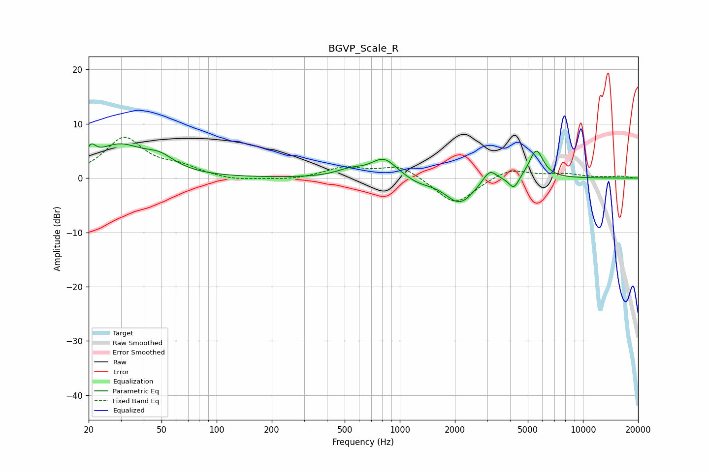

# BGVP_Scale_R
See [usage instructions](https://github.com/jaakkopasanen/AutoEq#usage) for more options and info.

### Parametric EQs
Apply preamp of -6.4 dB when using parametric equalizer.

|   # | Type    |   Fc (Hz) |    Q |   Gain (dB) |
|-----|---------|-----------|------|-------------|
|   1 | Peaking |        21 | 5.83 |         2.4 |
|   2 | Peaking |        29 | 1.02 |         5.7 |
|   3 | Peaking |        49 | 1.72 |         2.3 |
|   4 | Peaking |       535 | 1.89 |         1.2 |
|   5 | Peaking |       819 | 1.98 |         3.6 |
|   6 | Peaking |      1258 | 2    |        -0.9 |
|   7 | Peaking |      2125 | 1.76 |        -4.7 |
|   8 | Peaking |      3093 | 3.67 |         2.5 |
|   9 | Peaking |      4198 | 5.2  |        -2.3 |
|  10 | Peaking |      5554 | 3.59 |         5.3 |

### Fixed Band EQs
When using fixed band (also called graphic) equalizer, apply preamp of **-7.6 dB** (if available) and set gains manually with these parameters.

|   # | Type    |   Fc (Hz) |    Q |   Gain (dB) |
|-----|---------|-----------|------|-------------|
|   1 | Peaking |        31 | 1.41 |         7.2 |
|   2 | Peaking |        62 | 1.41 |         1.7 |
|   3 | Peaking |       125 | 1.41 |        -0.6 |
|   4 | Peaking |       250 | 1.41 |        -0.4 |
|   5 | Peaking |       500 | 1.41 |         1.9 |
|   6 | Peaking |      1000 | 1.41 |         2.4 |
|   7 | Peaking |      2000 | 1.41 |        -5   |
|   8 | Peaking |      4000 | 1.41 |         1.9 |
|   9 | Peaking |      8000 | 1.41 |         0.7 |
|  10 | Peaking |     16000 | 1.41 |         0.3 |

### Graphs

