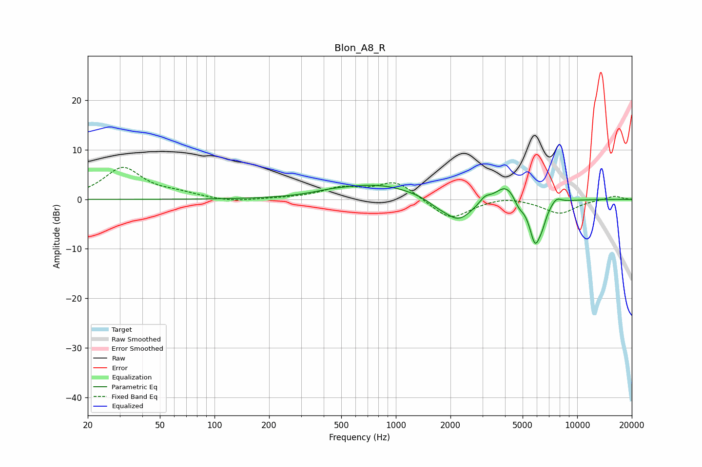

# Blon_A8_R
See [usage instructions](https://github.com/jaakkopasanen/AutoEq#usage) for more options and info.

### Parametric EQs
Apply preamp of -2.9 dB when using parametric equalizer.

|   # | Type    |   Fc (Hz) |    Q |   Gain (dB) |
|-----|---------|-----------|------|-------------|
|   1 | Peaking |       440 | 1.4  |         0.5 |
|   2 | Peaking |       800 | 0.67 |         2.9 |
|   3 | Peaking |      1683 | 2.5  |        -0.9 |
|   4 | Peaking |      2214 | 1.76 |        -4.7 |
|   5 | Peaking |      3100 | 4.97 |         1.1 |
|   6 | Peaking |      4065 | 2.35 |         3.6 |
|   7 | Peaking |      4764 | 5.34 |        -1.6 |
|   8 | Peaking |      5861 | 4.13 |        -8.6 |
|   9 | Peaking |      6418 | 6    |        -1.9 |
|  10 | Peaking |      7682 | 5.02 |         1.2 |

### Fixed Band EQs
When using fixed band (also called graphic) equalizer, apply preamp of **-6.6 dB** (if available) and set gains manually with these parameters.

|   # | Type    |   Fc (Hz) |    Q |   Gain (dB) |
|-----|---------|-----------|------|-------------|
|   1 | Peaking |        31 | 1.41 |         6.3 |
|   2 | Peaking |        62 | 1.41 |         0.9 |
|   3 | Peaking |       125 | 1.41 |        -0.6 |
|   4 | Peaking |       250 | 1.41 |         0.1 |
|   5 | Peaking |       500 | 1.41 |         2.1 |
|   6 | Peaking |      1000 | 1.41 |         3.6 |
|   7 | Peaking |      2000 | 1.41 |        -4.2 |
|   8 | Peaking |      4000 | 1.41 |         0.8 |
|   9 | Peaking |      8000 | 1.41 |        -2.8 |
|  10 | Peaking |     16000 | 1.41 |         0.7 |

### Graphs

