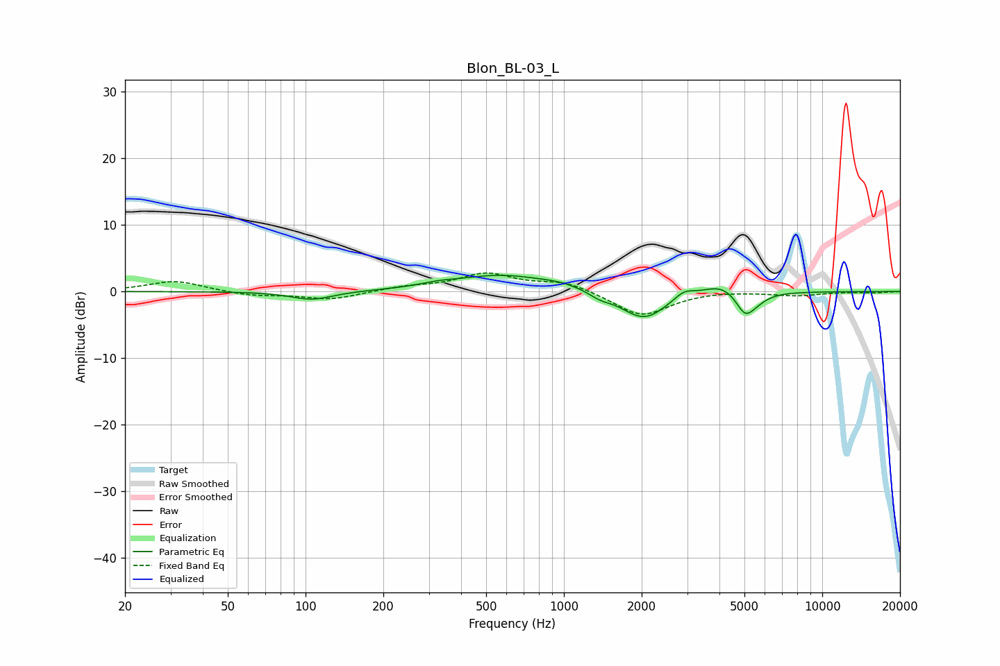

# Blon_BL-03_L
See [usage instructions](https://github.com/jaakkopasanen/AutoEq#usage) for more options and info.

### Parametric EQs
Apply preamp of -2.5 dB when using parametric equalizer.

|   # | Type    |   Fc (Hz) |    Q |   Gain (dB) |
|-----|---------|-----------|------|-------------|
|   1 | Peaking |       106 | 1.74 |        -1.3 |
|   2 | Peaking |       325 | 2.18 |         0.4 |
|   3 | Peaking |       573 | 0.77 |         2.4 |
|   4 | Peaking |       982 | 1.8  |         0.6 |
|   5 | Peaking |      1381 | 3.45 |        -0.7 |
|   6 | Peaking |      2039 | 1.59 |        -4.3 |
|   7 | Peaking |      2916 | 3.87 |         1.1 |
|   8 | Peaking |      4105 | 1.87 |         1.7 |
|   9 | Peaking |      5014 | 3.91 |        -3   |
|  10 | Peaking |      5451 | 2.79 |        -1.2 |

### Fixed Band EQs
When using fixed band (also called graphic) equalizer, apply preamp of **-2.9 dB** (if available) and set gains manually with these parameters.

|   # | Type    |   Fc (Hz) |    Q |   Gain (dB) |
|-----|---------|-----------|------|-------------|
|   1 | Peaking |        31 | 1.41 |         1.6 |
|   2 | Peaking |        62 | 1.41 |        -0.6 |
|   3 | Peaking |       125 | 1.41 |        -1.2 |
|   4 | Peaking |       250 | 1.41 |         0.7 |
|   5 | Peaking |       500 | 1.41 |         2.6 |
|   6 | Peaking |      1000 | 1.41 |         1.4 |
|   7 | Peaking |      2000 | 1.41 |        -3.7 |
|   8 | Peaking |      4000 | 1.41 |         0.2 |
|   9 | Peaking |      8000 | 1.41 |        -0.6 |
|  10 | Peaking |     16000 | 1.41 |        -0.2 |

### Graphs

