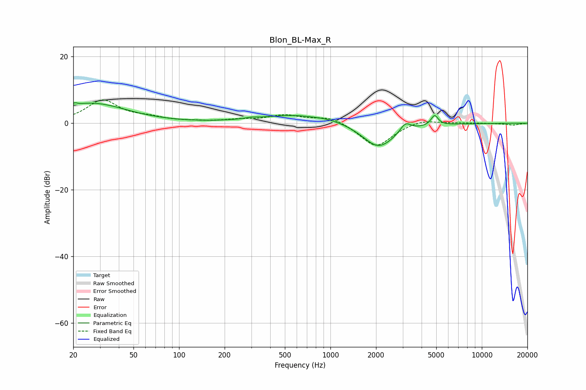

# Blon_BL-Max_R
See [usage instructions](https://github.com/jaakkopasanen/AutoEq#usage) for more options and info.

### Parametric EQs
Apply preamp of -6.2 dB when using parametric equalizer.

|   # | Type    |   Fc (Hz) |    Q |   Gain (dB) |
|-----|---------|-----------|------|-------------|
|   1 | Peaking |        20 | 0.71 |         1.2 |
|   2 | Peaking |        21 | 5.81 |         3.3 |
|   3 | Peaking |        21 | 5.85 |        -2.6 |
|   4 | Peaking |        28 | 0.64 |         4.9 |
|   5 | Peaking |       301 | 3.67 |         0.4 |
|   6 | Peaking |       700 | 0.53 |         3   |
|   7 | Peaking |       729 | 2.11 |        -0.3 |
|   8 | Peaking |      2075 | 1.24 |        -7.9 |
|   9 | Peaking |      3128 | 3.93 |         2.8 |
|  10 | Peaking |      4876 | 6    |         3.1 |

### Fixed Band EQs
When using fixed band (also called graphic) equalizer, apply preamp of **-7.1 dB** (if available) and set gains manually with these parameters.

|   # | Type    |   Fc (Hz) |    Q |   Gain (dB) |
|-----|---------|-----------|------|-------------|
|   1 | Peaking |        31 | 1.41 |         6.7 |
|   2 | Peaking |        62 | 1.41 |         1.3 |
|   3 | Peaking |       125 | 1.41 |         0.3 |
|   4 | Peaking |       250 | 1.41 |         0.8 |
|   5 | Peaking |       500 | 1.41 |         2.3 |
|   6 | Peaking |      1000 | 1.41 |         2.1 |
|   7 | Peaking |      2000 | 1.41 |        -7.3 |
|   8 | Peaking |      4000 | 1.41 |         1.4 |
|   9 | Peaking |      8000 | 1.41 |         0.1 |
|  10 | Peaking |     16000 | 1.41 |        -0.6 |

### Graphs

