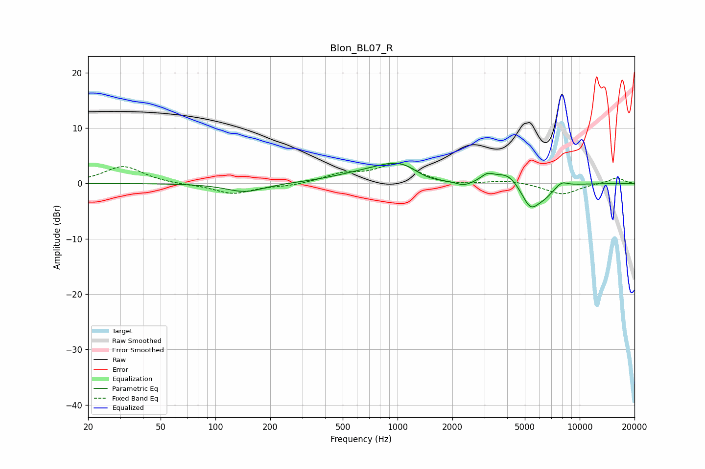

# Blon_BL07_R
See [usage instructions](https://github.com/jaakkopasanen/AutoEq#usage) for more options and info.

### Parametric EQs
Apply preamp of -3.8 dB when using parametric equalizer.

|   # | Type    |   Fc (Hz) |    Q |   Gain (dB) |
|-----|---------|-----------|------|-------------|
|   1 | Peaking |       145 | 1.37 |        -1.6 |
|   2 | Peaking |       644 | 0.8  |         1.2 |
|   3 | Peaking |      1056 | 1.09 |         3.6 |
|   4 | Peaking |      1423 | 1.42 |        -1.5 |
|   5 | Peaking |      2320 | 2.88 |        -0.9 |
|   6 | Peaking |      3113 | 4.02 |         1.2 |
|   7 | Peaking |      4023 | 2.11 |         2.2 |
|   8 | Peaking |      5356 | 2.75 |        -4.3 |
|   9 | Peaking |      6411 | 2.49 |        -1.6 |
|  10 | Peaking |      7952 | 3.91 |         1   |

### Fixed Band EQs
When using fixed band (also called graphic) equalizer, apply preamp of **-3.7 dB** (if available) and set gains manually with these parameters.

|   # | Type    |   Fc (Hz) |    Q |   Gain (dB) |
|-----|---------|-----------|------|-------------|
|   1 | Peaking |        31 | 1.41 |         3.1 |
|   2 | Peaking |        62 | 1.41 |        -0.2 |
|   3 | Peaking |       125 | 1.41 |        -1.9 |
|   4 | Peaking |       250 | 1.41 |        -0.4 |
|   5 | Peaking |       500 | 1.41 |         1.5 |
|   6 | Peaking |      1000 | 1.41 |         3.4 |
|   7 | Peaking |      2000 | 1.41 |        -0.5 |
|   8 | Peaking |      4000 | 1.41 |         0.6 |
|   9 | Peaking |      8000 | 1.41 |        -2   |
|  10 | Peaking |     16000 | 1.41 |         1.1 |

### Graphs

