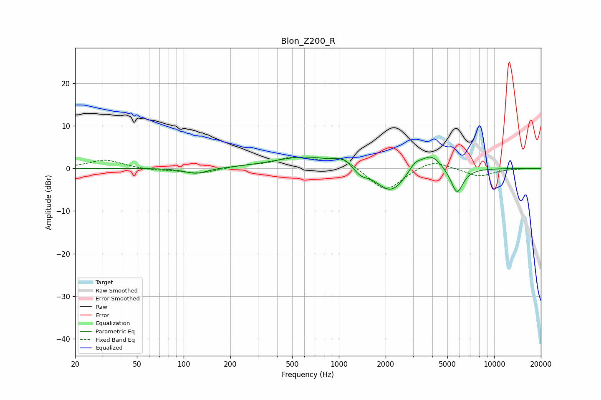

# Blon_Z200_R
See [usage instructions](https://github.com/jaakkopasanen/AutoEq#usage) for more options and info.

### Parametric EQs
Apply preamp of -2.7 dB when using parametric equalizer.

|   # | Type    |   Fc (Hz) |    Q |   Gain (dB) |
|-----|---------|-----------|------|-------------|
|   1 | Peaking |       120 | 1.97 |        -1.3 |
|   2 | Peaking |       607 | 0.71 |         2.8 |
|   3 | Peaking |      1059 | 2.86 |         1.1 |
|   4 | Peaking |      1089 | 2.45 |         0.6 |
|   5 | Peaking |      1378 | 3.18 |        -1.5 |
|   6 | Peaking |      1976 | 1.38 |        -0.6 |
|   7 | Peaking |      2177 | 1.55 |        -5.3 |
|   8 | Peaking |      3087 | 3.48 |         2   |
|   9 | Peaking |      3917 | 2.04 |         3.9 |
|  10 | Peaking |      5762 | 3.46 |        -6.1 |

### Fixed Band EQs
When using fixed band (also called graphic) equalizer, apply preamp of **-2.7 dB** (if available) and set gains manually with these parameters.

|   # | Type    |   Fc (Hz) |    Q |   Gain (dB) |
|-----|---------|-----------|------|-------------|
|   1 | Peaking |        31 | 1.41 |         2   |
|   2 | Peaking |        62 | 1.41 |        -0.4 |
|   3 | Peaking |       125 | 1.41 |        -1.2 |
|   4 | Peaking |       250 | 1.41 |         0.6 |
|   5 | Peaking |       500 | 1.41 |         2.2 |
|   6 | Peaking |      1000 | 1.41 |         2.8 |
|   7 | Peaking |      2000 | 1.41 |        -5.6 |
|   8 | Peaking |      4000 | 1.41 |         2.2 |
|   9 | Peaking |      8000 | 1.41 |        -1.9 |
|  10 | Peaking |     16000 | 1.41 |        -0   |

### Graphs

