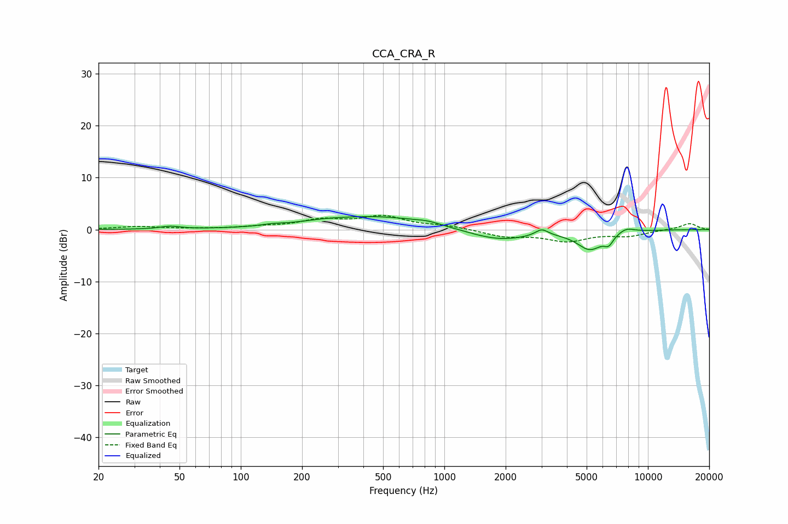

# CCA_CRA_R
See [usage instructions](https://github.com/jaakkopasanen/AutoEq#usage) for more options and info.

### Parametric EQs
Apply preamp of -2.6 dB when using parametric equalizer.

|   # | Type    |   Fc (Hz) |    Q |   Gain (dB) |
|-----|---------|-----------|------|-------------|
|   1 | Peaking |        45 | 2.83 |         0.5 |
|   2 | Peaking |       142 | 2.93 |         0.3 |
|   3 | Peaking |       249 | 1.56 |         0.3 |
|   4 | Peaking |       463 | 0.48 |         2.6 |
|   5 | Peaking |       828 | 2.59 |         0.4 |
|   6 | Peaking |      1834 | 0.91 |        -2.2 |
|   7 | Peaking |      3009 | 4.5  |         1.3 |
|   8 | Peaking |      5188 | 2.17 |        -3.5 |
|   9 | Peaking |      6419 | 6    |        -1.6 |
|  10 | Peaking |      7824 | 3.32 |         0.9 |

### Fixed Band EQs
When using fixed band (also called graphic) equalizer, apply preamp of **-2.8 dB** (if available) and set gains manually with these parameters.

|   # | Type    |   Fc (Hz) |    Q |   Gain (dB) |
|-----|---------|-----------|------|-------------|
|   1 | Peaking |        31 | 1.41 |         0.6 |
|   2 | Peaking |        62 | 1.41 |         0.1 |
|   3 | Peaking |       125 | 1.41 |         0.4 |
|   4 | Peaking |       250 | 1.41 |         1.7 |
|   5 | Peaking |       500 | 1.41 |         2.4 |
|   6 | Peaking |      1000 | 1.41 |         0.7 |
|   7 | Peaking |      2000 | 1.41 |        -1.3 |
|   8 | Peaking |      4000 | 1.41 |        -2.1 |
|   9 | Peaking |      8000 | 1.41 |        -1.1 |
|  10 | Peaking |     16000 | 1.41 |         1.2 |

### Graphs

