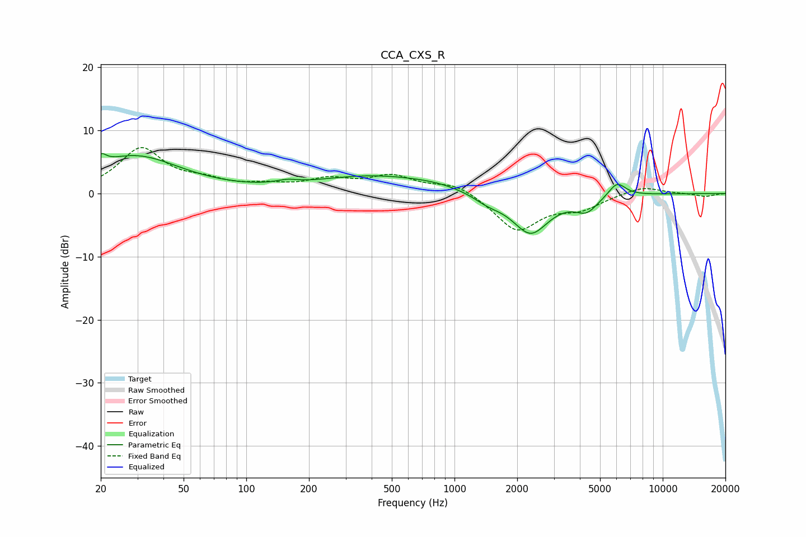

# CCA_CXS_R
See [usage instructions](https://github.com/jaakkopasanen/AutoEq#usage) for more options and info.

### Parametric EQs
Apply preamp of -6.4 dB when using parametric equalizer.

|   # | Type    |   Fc (Hz) |    Q |   Gain (dB) |
|-----|---------|-----------|------|-------------|
|   1 | Peaking |        20 | 5.61 |         1.6 |
|   2 | Peaking |        29 | 0.64 |         5.9 |
|   3 | Peaking |       157 | 2.9  |         0.5 |
|   4 | Peaking |       406 | 0.5  |         2.7 |
|   5 | Peaking |       828 | 1.01 |         0.6 |
|   6 | Peaking |      1441 | 2.03 |        -1.1 |
|   7 | Peaking |      2193 | 2.06 |         0.4 |
|   8 | Peaking |      2307 | 1.6  |        -6.7 |
|   9 | Peaking |      4313 | 2.6  |        -2.3 |
|  10 | Peaking |      6031 | 3.32 |         2.3 |

### Fixed Band EQs
When using fixed band (also called graphic) equalizer, apply preamp of **-7.4 dB** (if available) and set gains manually with these parameters.

|   # | Type    |   Fc (Hz) |    Q |   Gain (dB) |
|-----|---------|-----------|------|-------------|
|   1 | Peaking |        31 | 1.41 |         7   |
|   2 | Peaking |        62 | 1.41 |         1.5 |
|   3 | Peaking |       125 | 1.41 |         1   |
|   4 | Peaking |       250 | 1.41 |         1.9 |
|   5 | Peaking |       500 | 1.41 |         2.5 |
|   6 | Peaking |      1000 | 1.41 |         1.7 |
|   7 | Peaking |      2000 | 1.41 |        -5.8 |
|   8 | Peaking |      4000 | 1.41 |        -2.1 |
|   9 | Peaking |      8000 | 1.41 |         1.2 |
|  10 | Peaking |     16000 | 1.41 |        -0.5 |

### Graphs

