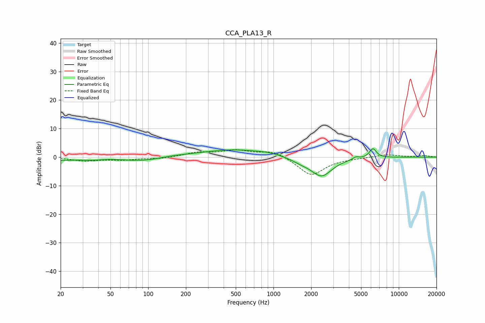

# CCA_PLA13_R
See [usage instructions](https://github.com/jaakkopasanen/AutoEq#usage) for more options and info.

### Parametric EQs
Apply preamp of -3.0 dB when using parametric equalizer.

|   # | Type    |   Fc (Hz) |    Q |   Gain (dB) |
|-----|---------|-----------|------|-------------|
|   1 | Peaking |        20 | 1.51 |        -1   |
|   2 | Peaking |        35 | 1.64 |        -0.7 |
|   3 | Peaking |        89 | 0.94 |        -1.4 |
|   4 | Peaking |       159 | 1.61 |         0.3 |
|   5 | Peaking |       489 | 0.52 |         2.7 |
|   6 | Peaking |       918 | 1.95 |         0.4 |
|   7 | Peaking |      1650 | 1.93 |        -1.1 |
|   8 | Peaking |      2416 | 1.65 |        -6.7 |
|   9 | Peaking |      4547 | 6    |         0.9 |
|  10 | Peaking |      6215 | 4.91 |         3.3 |

### Fixed Band EQs
When using fixed band (also called graphic) equalizer, apply preamp of **-2.7 dB** (if available) and set gains manually with these parameters.

|   # | Type    |   Fc (Hz) |    Q |   Gain (dB) |
|-----|---------|-----------|------|-------------|
|   1 | Peaking |        31 | 1.41 |        -1.2 |
|   2 | Peaking |        62 | 1.41 |        -0.9 |
|   3 | Peaking |       125 | 1.41 |        -0.6 |
|   4 | Peaking |       250 | 1.41 |         1.5 |
|   5 | Peaking |       500 | 1.41 |         2.2 |
|   6 | Peaking |      1000 | 1.41 |         2.3 |
|   7 | Peaking |      2000 | 1.41 |        -6.5 |
|   8 | Peaking |      4000 | 1.41 |        -0.2 |
|   9 | Peaking |      8000 | 1.41 |         0.9 |
|  10 | Peaking |     16000 | 1.41 |         0.5 |

### Graphs

