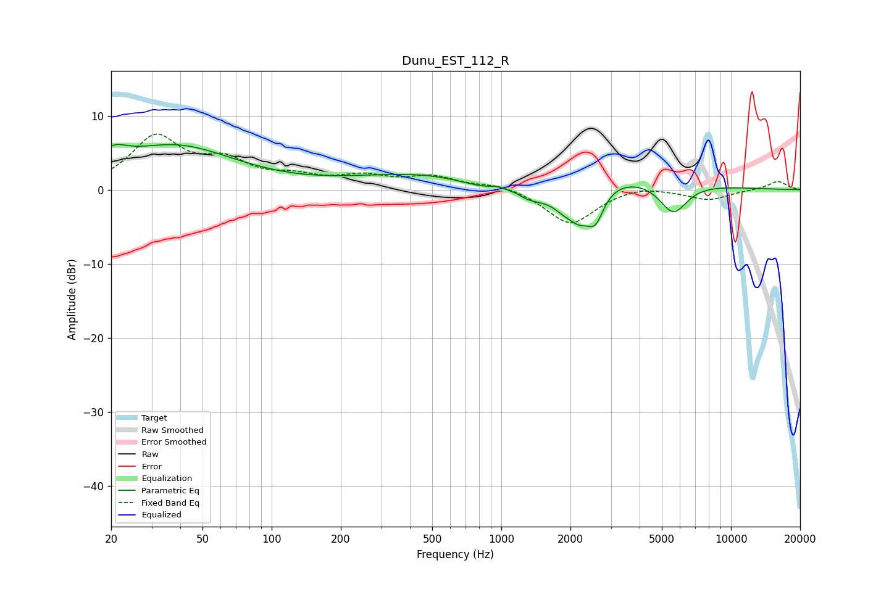

# Dunu_EST_112_R
See [usage instructions](https://github.com/jaakkopasanen/AutoEq#usage) for more options and info.

### Parametric EQs
Apply preamp of -6.2 dB when using parametric equalizer.

|   # | Type    |   Fc (Hz) |    Q |   Gain (dB) |
|-----|---------|-----------|------|-------------|
|   1 | Peaking |        20 | 2.32 |         2.1 |
|   2 | Peaking |        38 | 0.54 |         5.8 |
|   3 | Peaking |       993 | 2.52 |         1.6 |
|   4 | Peaking |      1165 | 4.56 |         0.6 |
|   5 | Peaking |      1165 | 0.84 |        -5.4 |
|   6 | Peaking |      1219 | 0.22 |         3.9 |
|   7 | Peaking |      1893 | 2.63 |        -2.1 |
|   8 | Peaking |      2189 | 3.2  |        -2.9 |
|   9 | Peaking |      2566 | 3.66 |        -4.3 |
|  10 | Peaking |      5606 | 2.26 |        -4.3 |

### Fixed Band EQs
When using fixed band (also called graphic) equalizer, apply preamp of **-7.6 dB** (if available) and set gains manually with these parameters.

|   # | Type    |   Fc (Hz) |    Q |   Gain (dB) |
|-----|---------|-----------|------|-------------|
|   1 | Peaking |        31 | 1.41 |         6.8 |
|   2 | Peaking |        62 | 1.41 |         3.2 |
|   3 | Peaking |       125 | 1.41 |         1.4 |
|   4 | Peaking |       250 | 1.41 |         1.5 |
|   5 | Peaking |       500 | 1.41 |         1.6 |
|   6 | Peaking |      1000 | 1.41 |         0.8 |
|   7 | Peaking |      2000 | 1.41 |        -4.7 |
|   8 | Peaking |      4000 | 1.41 |         0.7 |
|   9 | Peaking |      8000 | 1.41 |        -1.3 |
|  10 | Peaking |     16000 | 1.41 |         1.2 |

### Graphs

