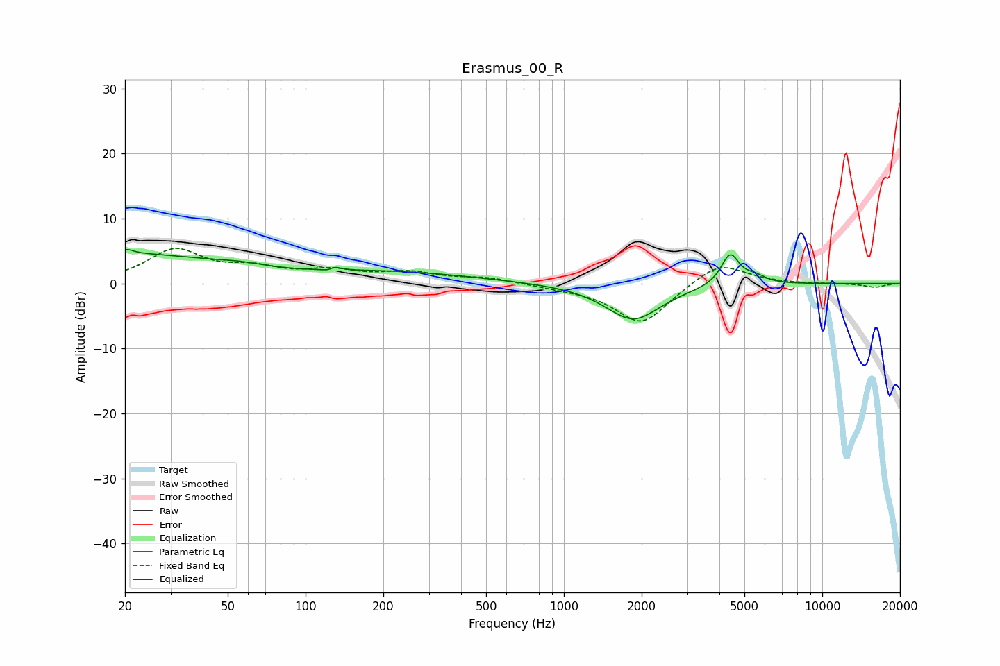

# Erasmus_00_R
See [usage instructions](https://github.com/jaakkopasanen/AutoEq#usage) for more options and info.

### Parametric EQs
Apply preamp of -5.3 dB when using parametric equalizer.

|   # | Type    |   Fc (Hz) |    Q |   Gain (dB) |
|-----|---------|-----------|------|-------------|
|   1 | Peaking |        20 | 0.38 |         4.4 |
|   2 | Peaking |        20 | 6    |        -2.2 |
|   3 | Peaking |        20 | 5.82 |         2.9 |
|   4 | Peaking |        56 | 1.48 |         0.6 |
|   5 | Peaking |       125 | 5.96 |        -1.8 |
|   6 | Peaking |       127 | 5.83 |         2.1 |
|   7 | Peaking |       216 | 0.45 |         1.6 |
|   8 | Peaking |      1854 | 1.32 |        -5.6 |
|   9 | Peaking |      4401 | 4    |         4.8 |
|  10 | Peaking |      5499 | 3.35 |         1   |

### Fixed Band EQs
When using fixed band (also called graphic) equalizer, apply preamp of **-5.5 dB** (if available) and set gains manually with these parameters.

|   # | Type    |   Fc (Hz) |    Q |   Gain (dB) |
|-----|---------|-----------|------|-------------|
|   1 | Peaking |        31 | 1.41 |         5   |
|   2 | Peaking |        62 | 1.41 |         1.9 |
|   3 | Peaking |       125 | 1.41 |         1.6 |
|   4 | Peaking |       250 | 1.41 |         1.5 |
|   5 | Peaking |       500 | 1.41 |         0.8 |
|   6 | Peaking |      1000 | 1.41 |        -0.5 |
|   7 | Peaking |      2000 | 1.41 |        -6.3 |
|   8 | Peaking |      4000 | 1.41 |         3.5 |
|   9 | Peaking |      8000 | 1.41 |        -0.1 |
|  10 | Peaking |     16000 | 1.41 |        -0.6 |

### Graphs

