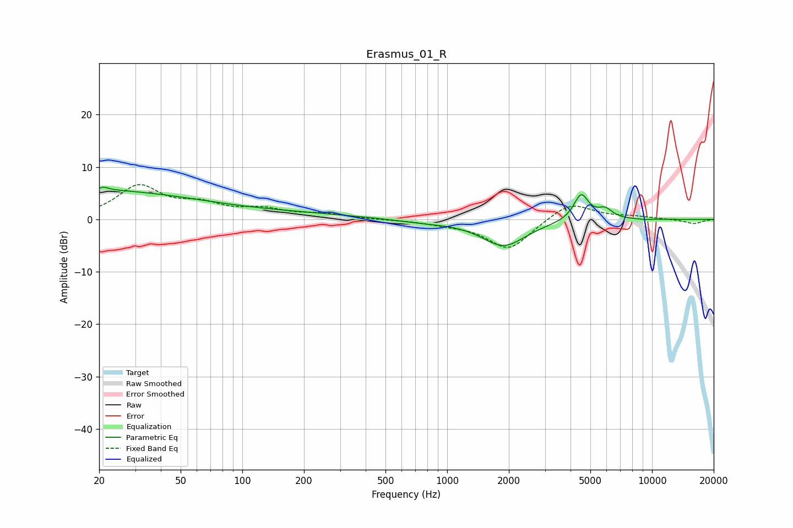

# Erasmus_01_R
See [usage instructions](https://github.com/jaakkopasanen/AutoEq#usage) for more options and info.

### Parametric EQs
Apply preamp of -6.2 dB when using parametric equalizer.

|   # | Type    |   Fc (Hz) |    Q |   Gain (dB) |
|-----|---------|-----------|------|-------------|
|   1 | Peaking |        20 | 0.36 |         4.8 |
|   2 | Peaking |        20 | 5.9  |        -2.7 |
|   3 | Peaking |        20 | 5.76 |         3.3 |
|   4 | Peaking |        33 | 1.22 |        -0.2 |
|   5 | Peaking |        85 | 0.26 |         1.4 |
|   6 | Peaking |       753 | 1.08 |        -0.5 |
|   7 | Peaking |      1890 | 1.31 |        -5   |
|   8 | Peaking |      4508 | 3.85 |         5   |
|   9 | Peaking |      5899 | 3.74 |         1.8 |
|  10 | Peaking |      9153 | 4.78 |        -0.1 |

### Fixed Band EQs
When using fixed band (also called graphic) equalizer, apply preamp of **-6.7 dB** (if available) and set gains manually with these parameters.

|   # | Type    |   Fc (Hz) |    Q |   Gain (dB) |
|-----|---------|-----------|------|-------------|
|   1 | Peaking |        31 | 1.41 |         6.1 |
|   2 | Peaking |        62 | 1.41 |         2.3 |
|   3 | Peaking |       125 | 1.41 |         1.7 |
|   4 | Peaking |       250 | 1.41 |         0.9 |
|   5 | Peaking |       500 | 1.41 |        -0   |
|   6 | Peaking |      1000 | 1.41 |        -0.7 |
|   7 | Peaking |      2000 | 1.41 |        -5.8 |
|   8 | Peaking |      4000 | 1.41 |         3.5 |
|   9 | Peaking |      8000 | 1.41 |         0.5 |
|  10 | Peaking |     16000 | 1.41 |        -0.9 |

### Graphs

