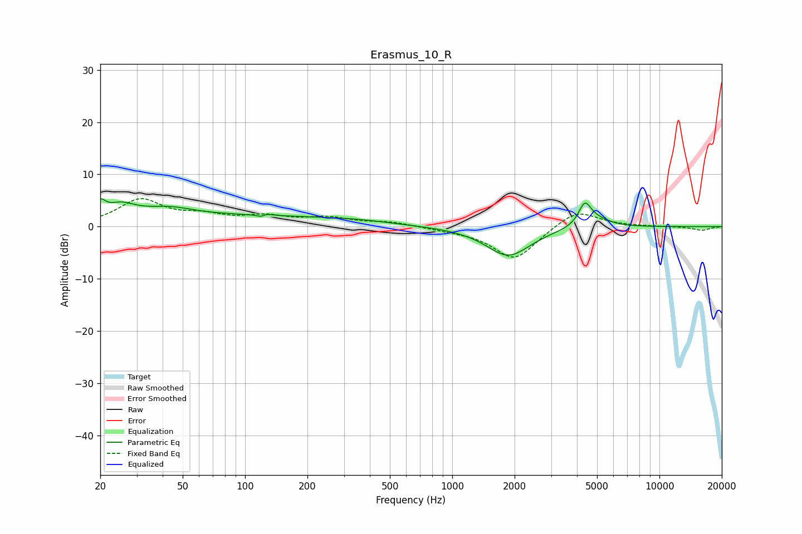

# Erasmus_10_R
See [usage instructions](https://github.com/jaakkopasanen/AutoEq#usage) for more options and info.

### Parametric EQs
Apply preamp of -5.4 dB when using parametric equalizer.

|   # | Type    |   Fc (Hz) |    Q |   Gain (dB) |
|-----|---------|-----------|------|-------------|
|   1 | Peaking |        20 | 5.97 |         2.5 |
|   2 | Peaking |        25 | 1.85 |         2.9 |
|   3 | Peaking |        42 | 1.17 |         1.9 |
|   4 | Peaking |        96 | 0.34 |         1.9 |
|   5 | Peaking |       122 | 5.97 |        -2   |
|   6 | Peaking |       124 | 5.89 |         1.9 |
|   7 | Peaking |       341 | 0.75 |         0.7 |
|   8 | Peaking |      1866 | 1.32 |        -5.6 |
|   9 | Peaking |      4361 | 4.74 |         4   |
|  10 | Peaking |      4915 | 2.04 |         1.5 |

### Fixed Band EQs
When using fixed band (also called graphic) equalizer, apply preamp of **-5.5 dB** (if available) and set gains manually with these parameters.

|   # | Type    |   Fc (Hz) |    Q |   Gain (dB) |
|-----|---------|-----------|------|-------------|
|   1 | Peaking |        31 | 1.41 |         5   |
|   2 | Peaking |        62 | 1.41 |         1.7 |
|   3 | Peaking |       125 | 1.41 |         1.7 |
|   4 | Peaking |       250 | 1.41 |         1.5 |
|   5 | Peaking |       500 | 1.41 |         0.8 |
|   6 | Peaking |      1000 | 1.41 |        -0.4 |
|   7 | Peaking |      2000 | 1.41 |        -6.4 |
|   8 | Peaking |      4000 | 1.41 |         3.5 |
|   9 | Peaking |      8000 | 1.41 |         0   |
|  10 | Peaking |     16000 | 1.41 |        -0.7 |

### Graphs

