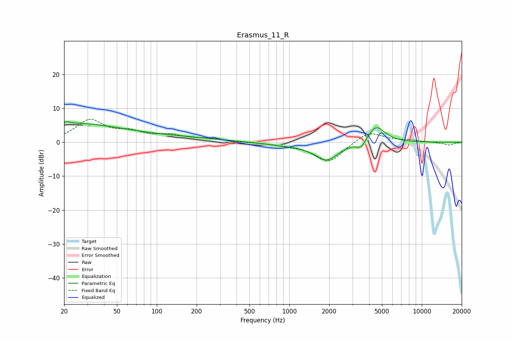

# Erasmus_11_R
See [usage instructions](https://github.com/jaakkopasanen/AutoEq#usage) for more options and info.

### Parametric EQs
Apply preamp of -6.2 dB when using parametric equalizer.

|   # | Type    |   Fc (Hz) |    Q |   Gain (dB) |
|-----|---------|-----------|------|-------------|
|   1 | Peaking |        20 | 0.4  |         4.8 |
|   2 | Peaking |        20 | 5.99 |        -2.9 |
|   3 | Peaking |        20 | 5.81 |         3.2 |
|   4 | Peaking |        83 | 0.3  |         1.7 |
|   5 | Peaking |        94 | 1.35 |        -0.1 |
|   6 | Peaking |       918 | 0.9  |        -0.7 |
|   7 | Peaking |      1903 | 1.55 |        -5.2 |
|   8 | Peaking |      3475 | 4.23 |        -2.3 |
|   9 | Peaking |      4410 | 4    |         0.5 |
|  10 | Peaking |      4549 | 2.02 |         4.7 |

### Fixed Band EQs
When using fixed band (also called graphic) equalizer, apply preamp of **-6.9 dB** (if available) and set gains manually with these parameters.

|   # | Type    |   Fc (Hz) |    Q |   Gain (dB) |
|-----|---------|-----------|------|-------------|
|   1 | Peaking |        31 | 1.41 |         6.3 |
|   2 | Peaking |        62 | 1.41 |         2.4 |
|   3 | Peaking |       125 | 1.41 |         1.7 |
|   4 | Peaking |       250 | 1.41 |         0.9 |
|   5 | Peaking |       500 | 1.41 |        -0   |
|   6 | Peaking |      1000 | 1.41 |        -0.7 |
|   7 | Peaking |      2000 | 1.41 |        -5.9 |
|   8 | Peaking |      4000 | 1.41 |         3.4 |
|   9 | Peaking |      8000 | 1.41 |         0.5 |
|  10 | Peaking |     16000 | 1.41 |        -0.8 |

### Graphs

