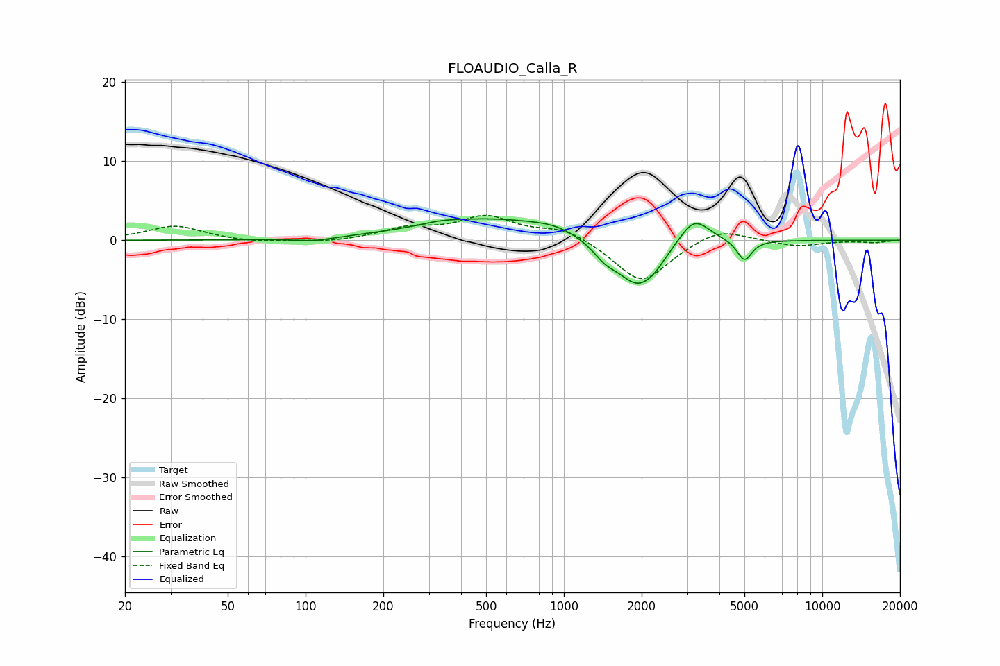

# FLOAUDIO_Calla_R
See [usage instructions](https://github.com/jaakkopasanen/AutoEq#usage) for more options and info.

### Parametric EQs
Apply preamp of -2.8 dB when using parametric equalizer.

|   # | Type    |   Fc (Hz) |    Q |   Gain (dB) |
|-----|---------|-----------|------|-------------|
|   1 | Peaking |       108 | 2.06 |        -0.4 |
|   2 | Peaking |       334 | 2.08 |         0.3 |
|   3 | Peaking |       518 | 0.52 |         2.7 |
|   4 | Peaking |       923 | 1.62 |         0.7 |
|   5 | Peaking |      1440 | 2.86 |        -0.5 |
|   6 | Peaking |      1445 | 3    |        -1   |
|   7 | Peaking |      1934 | 1.69 |        -5.9 |
|   8 | Peaking |      2256 | 3.49 |        -0.7 |
|   9 | Peaking |      3195 | 2.39 |         3.5 |
|  10 | Peaking |      5001 | 4.95 |        -2.7 |

### Fixed Band EQs
When using fixed band (also called graphic) equalizer, apply preamp of **-3.2 dB** (if available) and set gains manually with these parameters.

|   # | Type    |   Fc (Hz) |    Q |   Gain (dB) |
|-----|---------|-----------|------|-------------|
|   1 | Peaking |        31 | 1.41 |         1.8 |
|   2 | Peaking |        62 | 1.41 |        -0.3 |
|   3 | Peaking |       125 | 1.41 |        -0.3 |
|   4 | Peaking |       250 | 1.41 |         1.4 |
|   5 | Peaking |       500 | 1.41 |         2.8 |
|   6 | Peaking |      1000 | 1.41 |         1.6 |
|   7 | Peaking |      2000 | 1.41 |        -5.5 |
|   8 | Peaking |      4000 | 1.41 |         1.8 |
|   9 | Peaking |      8000 | 1.41 |        -0.8 |
|  10 | Peaking |     16000 | 1.41 |        -0.3 |

### Graphs

