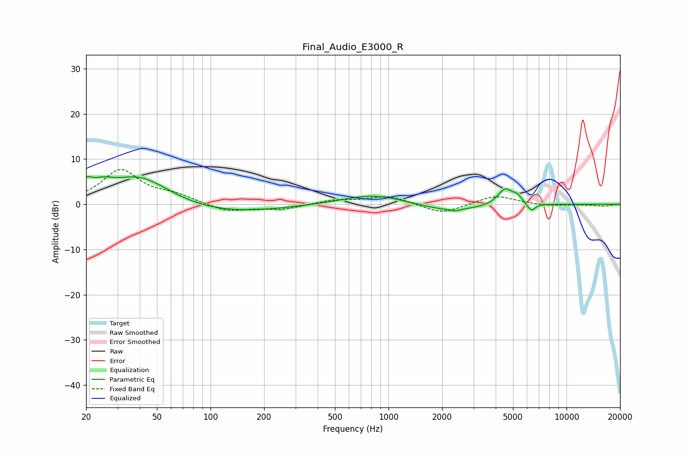

# Final_Audio_E3000_R
See [usage instructions](https://github.com/jaakkopasanen/AutoEq#usage) for more options and info.

### Parametric EQs
Apply preamp of -6.2 dB when using parametric equalizer.

|   # | Type    |   Fc (Hz) |    Q |   Gain (dB) |
|-----|---------|-----------|------|-------------|
|   1 | Peaking |        20 | 4.38 |         2.6 |
|   2 | Peaking |        25 | 2.28 |         2.1 |
|   3 | Peaking |        40 | 0.82 |         6.5 |
|   4 | Peaking |       112 | 0.45 |        -2.2 |
|   5 | Peaking |       830 | 0.8  |         2.3 |
|   6 | Peaking |      2184 | 0.82 |        -1.7 |
|   7 | Peaking |      2362 | 5.98 |        -0.4 |
|   8 | Peaking |      4519 | 3.33 |         3.6 |
|   9 | Peaking |      5294 | 5.32 |         1.4 |
|  10 | Peaking |      6335 | 5.98 |        -1.7 |

### Fixed Band EQs
When using fixed band (also called graphic) equalizer, apply preamp of **-7.8 dB** (if available) and set gains manually with these parameters.

|   # | Type    |   Fc (Hz) |    Q |   Gain (dB) |
|-----|---------|-----------|------|-------------|
|   1 | Peaking |        31 | 1.41 |         7.5 |
|   2 | Peaking |        62 | 1.41 |         1.6 |
|   3 | Peaking |       125 | 1.41 |        -1.7 |
|   4 | Peaking |       250 | 1.41 |        -1.1 |
|   5 | Peaking |       500 | 1.41 |         0.9 |
|   6 | Peaking |      1000 | 1.41 |         1.9 |
|   7 | Peaking |      2000 | 1.41 |        -2.2 |
|   8 | Peaking |      4000 | 1.41 |         2   |
|   9 | Peaking |      8000 | 1.41 |        -0.4 |
|  10 | Peaking |     16000 | 1.41 |        -0.4 |

### Graphs

