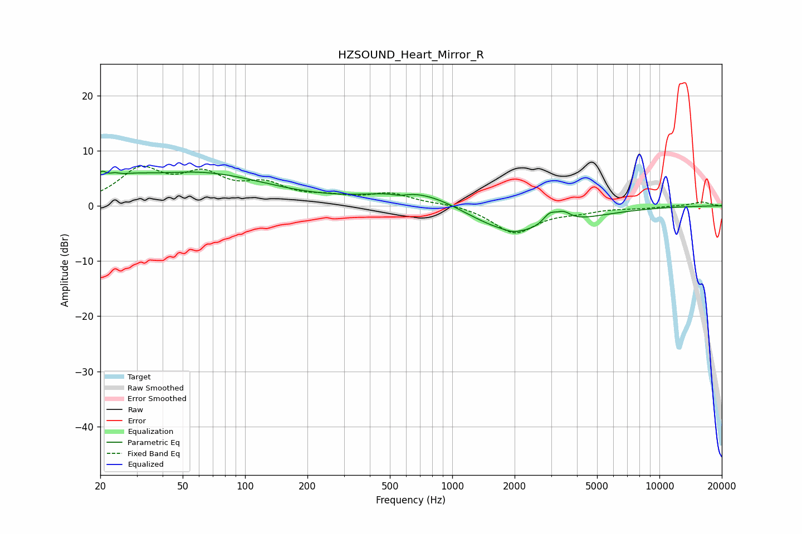

# HZSOUND_Heart_Mirror_R
See [usage instructions](https://github.com/jaakkopasanen/AutoEq#usage) for more options and info.

### Parametric EQs
Apply preamp of -6.4 dB when using parametric equalizer.

|   # | Type    |   Fc (Hz) |    Q |   Gain (dB) |
|-----|---------|-----------|------|-------------|
|   1 | Peaking |        20 | 5.99 |         2.3 |
|   2 | Peaking |        23 | 5.53 |         0.7 |
|   3 | Peaking |        27 | 1.19 |         2.1 |
|   4 | Peaking |        62 | 0.44 |         5.6 |
|   5 | Peaking |       559 | 3.96 |        -0.5 |
|   6 | Peaking |       739 | 0.64 |         4   |
|   7 | Peaking |      1937 | 0.55 |        -5.8 |
|   8 | Peaking |      1963 | 4.31 |        -0.4 |
|   9 | Peaking |      2948 | 4.2  |         2   |
|  10 | Peaking |      3438 | 3.77 |         1.8 |

### Fixed Band EQs
When using fixed band (also called graphic) equalizer, apply preamp of **-7.3 dB** (if available) and set gains manually with these parameters.

|   # | Type    |   Fc (Hz) |    Q |   Gain (dB) |
|-----|---------|-----------|------|-------------|
|   1 | Peaking |        31 | 1.41 |         6.1 |
|   2 | Peaking |        62 | 1.41 |         4.8 |
|   3 | Peaking |       125 | 1.41 |         3.2 |
|   4 | Peaking |       250 | 1.41 |         1.2 |
|   5 | Peaking |       500 | 1.41 |         2.1 |
|   6 | Peaking |      1000 | 1.41 |         0.4 |
|   7 | Peaking |      2000 | 1.41 |        -4.9 |
|   8 | Peaking |      4000 | 1.41 |        -0.8 |
|   9 | Peaking |      8000 | 1.41 |        -0.3 |
|  10 | Peaking |     16000 | 1.41 |         0.7 |

### Graphs

