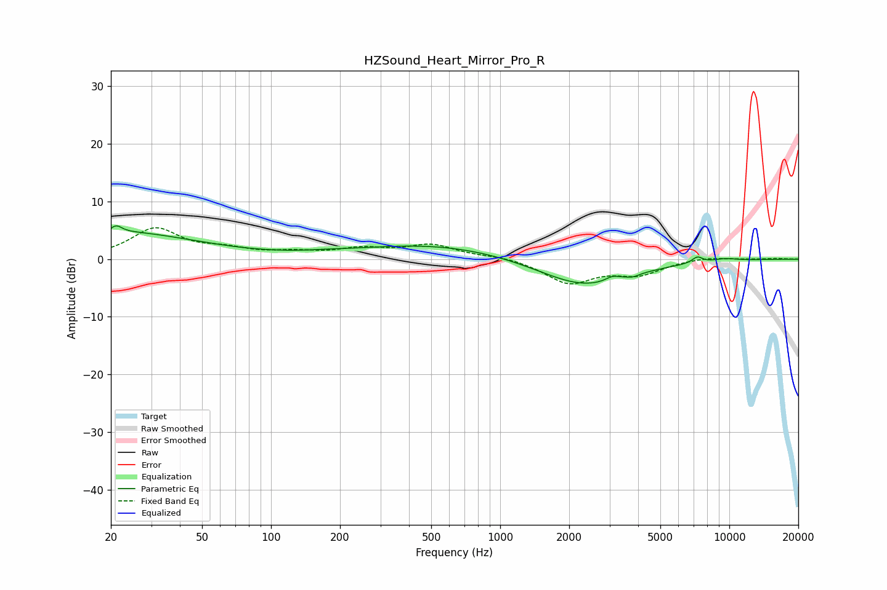

# HZSound_Heart_Mirror_Pro_R
See [usage instructions](https://github.com/jaakkopasanen/AutoEq#usage) for more options and info.

### Parametric EQs
Apply preamp of -5.9 dB when using parametric equalizer.

|   # | Type    |   Fc (Hz) |    Q |   Gain (dB) |
|-----|---------|-----------|------|-------------|
|   1 | Peaking |        21 | 0.83 |         1.4 |
|   2 | Peaking |        21 | 5.73 |         1.3 |
|   3 | Peaking |        28 | 0.46 |         3.3 |
|   4 | Peaking |       178 | 1.5  |         0.2 |
|   5 | Peaking |       516 | 0.41 |         2.6 |
|   6 | Peaking |      2323 | 0.7  |        -4.9 |
|   7 | Peaking |      3089 | 4.74 |         0.8 |
|   8 | Peaking |      3804 | 5.71 |        -0.4 |
|   9 | Peaking |      7248 | 5.87 |         1.1 |
|  10 | Peaking |      9565 | 2.33 |         0.4 |

### Fixed Band EQs
When using fixed band (also called graphic) equalizer, apply preamp of **-5.6 dB** (if available) and set gains manually with these parameters.

|   # | Type    |   Fc (Hz) |    Q |   Gain (dB) |
|-----|---------|-----------|------|-------------|
|   1 | Peaking |        31 | 1.41 |         5.2 |
|   2 | Peaking |        62 | 1.41 |         1.3 |
|   3 | Peaking |       125 | 1.41 |         0.9 |
|   4 | Peaking |       250 | 1.41 |         1.5 |
|   5 | Peaking |       500 | 1.41 |         2.3 |
|   6 | Peaking |      1000 | 1.41 |         0.5 |
|   7 | Peaking |      2000 | 1.41 |        -4.1 |
|   8 | Peaking |      4000 | 1.41 |        -2.4 |
|   9 | Peaking |      8000 | 1.41 |         0.5 |
|  10 | Peaking |     16000 | 1.41 |         0.1 |

### Graphs

