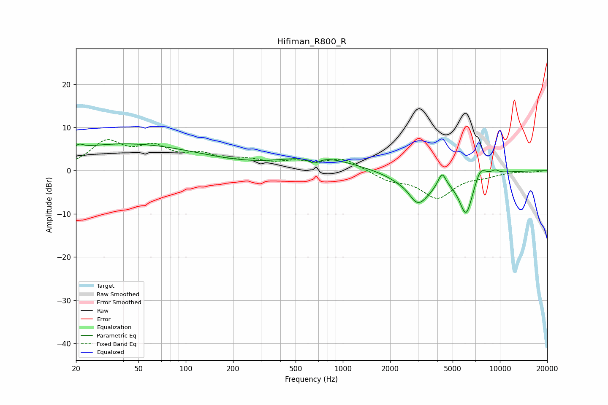

# Hifiman_R800_R
See [usage instructions](https://github.com/jaakkopasanen/AutoEq#usage) for more options and info.

### Parametric EQs
Apply preamp of -6.3 dB when using parametric equalizer.

|   # | Type    |   Fc (Hz) |    Q |   Gain (dB) |
|-----|---------|-----------|------|-------------|
|   1 | Peaking |        21 | 5.9  |         0.9 |
|   2 | Peaking |        41 | 0.29 |         6.2 |
|   3 | Peaking |       656 | 4.01 |        -1.5 |
|   4 | Peaking |       690 | 0.67 |         3.1 |
|   5 | Peaking |      2596 | 2.89 |         1.2 |
|   6 | Peaking |      2966 | 1.67 |        -8.2 |
|   7 | Peaking |      4278 | 5.64 |         3.4 |
|   8 | Peaking |      6093 | 2.95 |        -9.7 |
|   9 | Peaking |      7494 | 3.65 |         3.2 |
|  10 | Peaking |      9337 | 5.41 |         0.8 |

### Fixed Band EQs
When using fixed band (also called graphic) equalizer, apply preamp of **-7.3 dB** (if available) and set gains manually with these parameters.

|   # | Type    |   Fc (Hz) |    Q |   Gain (dB) |
|-----|---------|-----------|------|-------------|
|   1 | Peaking |        31 | 1.41 |         6.2 |
|   2 | Peaking |        62 | 1.41 |         4.5 |
|   3 | Peaking |       125 | 1.41 |         2.9 |
|   4 | Peaking |       250 | 1.41 |         1.9 |
|   5 | Peaking |       500 | 1.41 |         1.6 |
|   6 | Peaking |      1000 | 1.41 |         2.7 |
|   7 | Peaking |      2000 | 1.41 |        -2   |
|   8 | Peaking |      4000 | 1.41 |        -6   |
|   9 | Peaking |      8000 | 1.41 |        -0.9 |
|  10 | Peaking |     16000 | 1.41 |        -0.2 |

### Graphs

