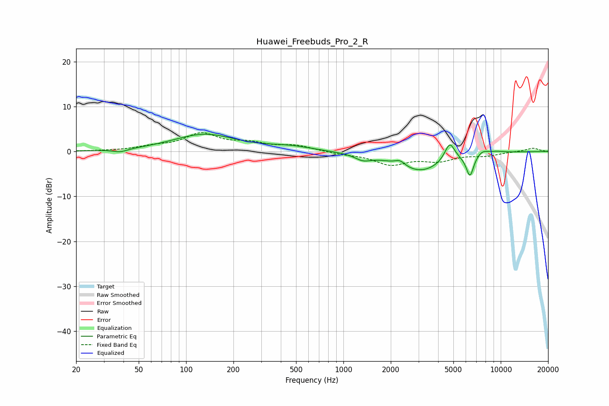

# Huawei_Freebuds_Pro_2_R
See [usage instructions](https://github.com/jaakkopasanen/AutoEq#usage) for more options and info.

### Parametric EQs
Apply preamp of -3.9 dB when using parametric equalizer.

|   # | Type    |   Fc (Hz) |    Q |   Gain (dB) |
|-----|---------|-----------|------|-------------|
|   1 | Peaking |        38 | 3.09 |        -0.7 |
|   2 | Peaking |       131 | 0.71 |         3.8 |
|   3 | Peaking |       459 | 1.01 |         0.9 |
|   4 | Peaking |      1332 | 2.74 |        -1.3 |
|   5 | Peaking |      2288 | 4.36 |         1.2 |
|   6 | Peaking |      3095 | 0.93 |        -4.4 |
|   7 | Peaking |      4738 | 4.24 |         4.2 |
|   8 | Peaking |      6372 | 5.73 |        -4.8 |
|   9 | Peaking |      7639 | 3.74 |         1   |
|  10 | Peaking |      9349 | 2.38 |         0.4 |

### Fixed Band EQs
When using fixed band (also called graphic) equalizer, apply preamp of **-4.3 dB** (if available) and set gains manually with these parameters.

|   # | Type    |   Fc (Hz) |    Q |   Gain (dB) |
|-----|---------|-----------|------|-------------|
|   1 | Peaking |        31 | 1.41 |         0.1 |
|   2 | Peaking |        62 | 1.41 |         0.9 |
|   3 | Peaking |       125 | 1.41 |         3.7 |
|   4 | Peaking |       250 | 1.41 |         1.5 |
|   5 | Peaking |       500 | 1.41 |         1.2 |
|   6 | Peaking |      1000 | 1.41 |        -0.5 |
|   7 | Peaking |      2000 | 1.41 |        -2.7 |
|   8 | Peaking |      4000 | 1.41 |        -1.8 |
|   9 | Peaking |      8000 | 1.41 |        -0.8 |
|  10 | Peaking |     16000 | 1.41 |         0.8 |

### Graphs

