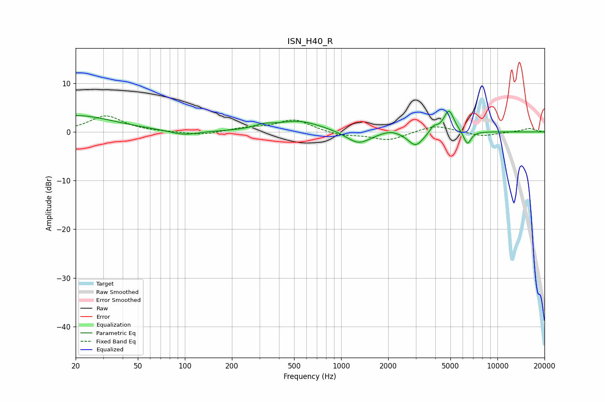

# ISN_H40_R
See [usage instructions](https://github.com/jaakkopasanen/AutoEq#usage) for more options and info.

### Parametric EQs
Apply preamp of -4.3 dB when using parametric equalizer.

|   # | Type    |   Fc (Hz) |    Q |   Gain (dB) |
|-----|---------|-----------|------|-------------|
|   1 | Peaking |        20 | 0.58 |         3.4 |
|   2 | Peaking |        99 | 1.63 |        -1   |
|   3 | Peaking |       317 | 2.46 |         0.7 |
|   4 | Peaking |       535 | 0.96 |         2.3 |
|   5 | Peaking |      1291 | 1.82 |        -2.7 |
|   6 | Peaking |      2070 | 2.25 |         0.7 |
|   7 | Peaking |      3000 | 2.88 |        -3   |
|   8 | Peaking |      3899 | 5.82 |         1.2 |
|   9 | Peaking |      4892 | 4.14 |         4.6 |
|  10 | Peaking |      6416 | 5.68 |        -2.9 |

### Fixed Band EQs
When using fixed band (also called graphic) equalizer, apply preamp of **-3.4 dB** (if available) and set gains manually with these parameters.

|   # | Type    |   Fc (Hz) |    Q |   Gain (dB) |
|-----|---------|-----------|------|-------------|
|   1 | Peaking |        31 | 1.41 |         3.3 |
|   2 | Peaking |        62 | 1.41 |        -0   |
|   3 | Peaking |       125 | 1.41 |        -0.7 |
|   4 | Peaking |       250 | 1.41 |         0.7 |
|   5 | Peaking |       500 | 1.41 |         2.5 |
|   6 | Peaking |      1000 | 1.41 |        -0.8 |
|   7 | Peaking |      2000 | 1.41 |        -1.7 |
|   8 | Peaking |      4000 | 1.41 |         1.4 |
|   9 | Peaking |      8000 | 1.41 |        -0.9 |
|  10 | Peaking |     16000 | 1.41 |         0.7 |

### Graphs

