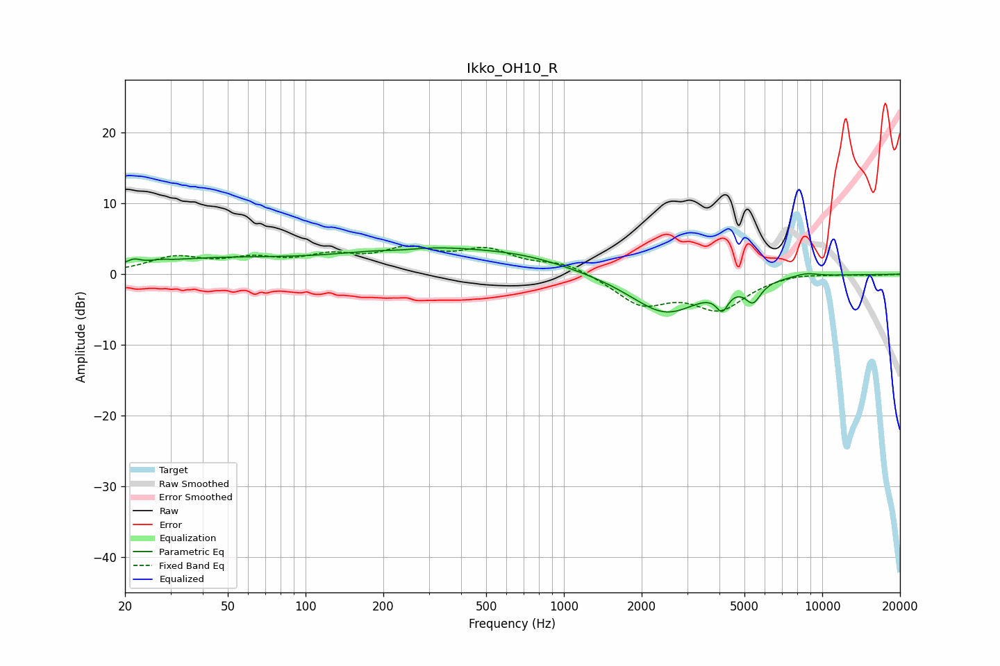

# Ikko_OH10_R
See [usage instructions](https://github.com/jaakkopasanen/AutoEq#usage) for more options and info.

### Parametric EQs
Apply preamp of -3.8 dB when using parametric equalizer.

|   # | Type    |   Fc (Hz) |    Q |   Gain (dB) |
|-----|---------|-----------|------|-------------|
|   1 | Peaking |        22 | 5.72 |         0.7 |
|   2 | Peaking |        28 | 5.16 |         0.2 |
|   3 | Peaking |        43 | 0.44 |         2   |
|   4 | Peaking |       234 | 1.99 |        -0.3 |
|   5 | Peaking |       285 | 0.46 |         3.3 |
|   6 | Peaking |       727 | 0.74 |         1.3 |
|   7 | Peaking |      2473 | 1.03 |        -5.6 |
|   8 | Peaking |      4100 | 5.99 |        -2.6 |
|   9 | Peaking |      5401 | 4.63 |        -2.7 |
|  10 | Peaking |      8655 | 2.75 |         0.5 |

### Fixed Band EQs
When using fixed band (also called graphic) equalizer, apply preamp of **-4.1 dB** (if available) and set gains manually with these parameters.

|   # | Type    |   Fc (Hz) |    Q |   Gain (dB) |
|-----|---------|-----------|------|-------------|
|   1 | Peaking |        31 | 1.41 |         2.2 |
|   2 | Peaking |        62 | 1.41 |         1.8 |
|   3 | Peaking |       125 | 1.41 |         2.1 |
|   4 | Peaking |       250 | 1.41 |         3   |
|   5 | Peaking |       500 | 1.41 |         3   |
|   6 | Peaking |      1000 | 1.41 |         1.6 |
|   7 | Peaking |      2000 | 1.41 |        -4.1 |
|   8 | Peaking |      4000 | 1.41 |        -4.6 |
|   9 | Peaking |      8000 | 1.41 |         0.4 |
|  10 | Peaking |     16000 | 1.41 |        -0.1 |

### Graphs

