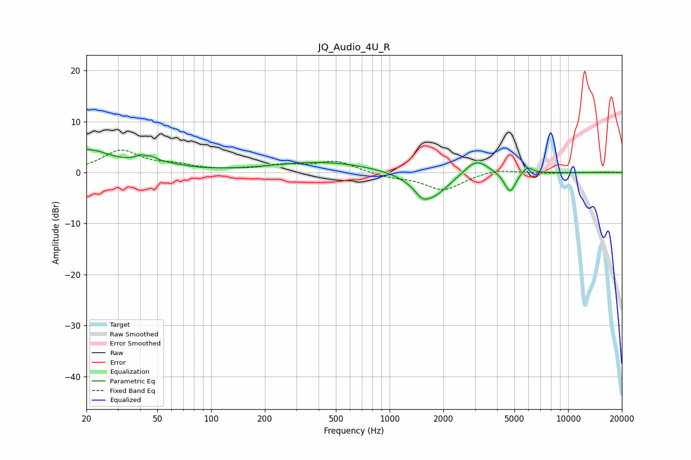

# JQ_Audio_4U_R
See [usage instructions](https://github.com/jaakkopasanen/AutoEq#usage) for more options and info.

### Parametric EQs
Apply preamp of -4.6 dB when using parametric equalizer.

|   # | Type    |   Fc (Hz) |    Q |   Gain (dB) |
|-----|---------|-----------|------|-------------|
|   1 | Peaking |        20 | 1.01 |         4.3 |
|   2 | Peaking |        43 | 3.89 |         3.3 |
|   3 | Peaking |        43 | 6    |        -1.9 |
|   4 | Peaking |        55 | 1.17 |         0.9 |
|   5 | Peaking |       423 | 0.5  |         2.1 |
|   6 | Peaking |      1514 | 3.96 |        -1.4 |
|   7 | Peaking |      1713 | 1.47 |        -5.1 |
|   8 | Peaking |      3051 | 2.11 |         3.2 |
|   9 | Peaking |      4722 | 4.4  |        -4.1 |
|  10 | Peaking |      5897 | 4.65 |         1.5 |

### Fixed Band EQs
When using fixed band (also called graphic) equalizer, apply preamp of **-4.5 dB** (if available) and set gains manually with these parameters.

|   # | Type    |   Fc (Hz) |    Q |   Gain (dB) |
|-----|---------|-----------|------|-------------|
|   1 | Peaking |        31 | 1.41 |         4.2 |
|   2 | Peaking |        62 | 1.41 |         1.1 |
|   3 | Peaking |       125 | 1.41 |         0.3 |
|   4 | Peaking |       250 | 1.41 |         1.3 |
|   5 | Peaking |       500 | 1.41 |         2.2 |
|   6 | Peaking |      1000 | 1.41 |        -0.8 |
|   7 | Peaking |      2000 | 1.41 |        -3.4 |
|   8 | Peaking |      4000 | 1.41 |         0.8 |
|   9 | Peaking |      8000 | 1.41 |        -0.1 |
|  10 | Peaking |     16000 | 1.41 |         0.1 |

### Graphs

