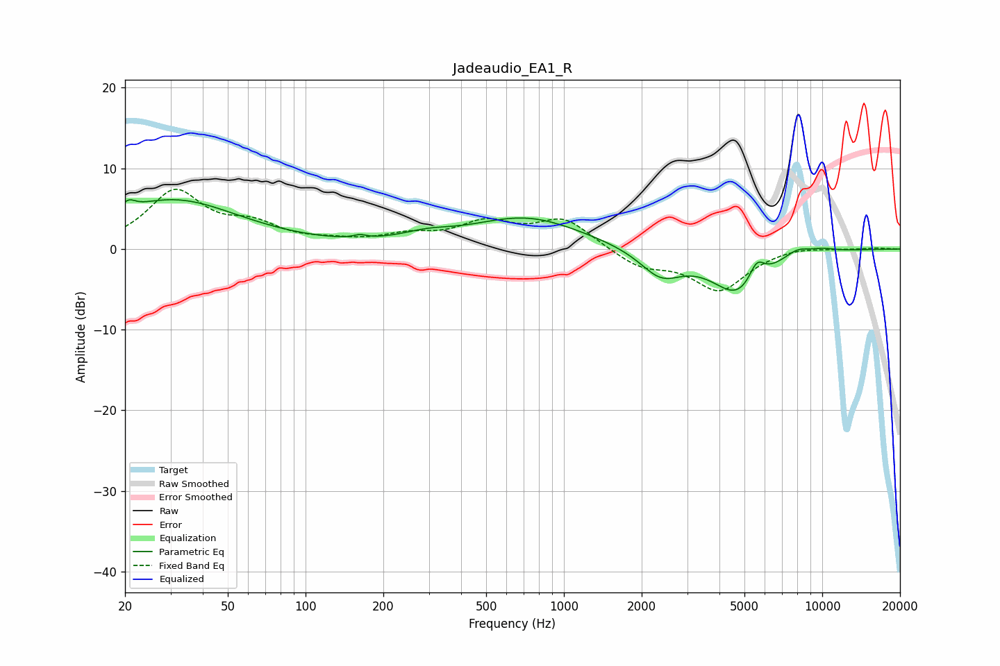

# Jadeaudio_EA1_R
See [usage instructions](https://github.com/jaakkopasanen/AutoEq#usage) for more options and info.

### Parametric EQs
Apply preamp of -6.2 dB when using parametric equalizer.

|   # | Type    |   Fc (Hz) |    Q |   Gain (dB) |
|-----|---------|-----------|------|-------------|
|   1 | Peaking |        21 | 5.82 |         1.1 |
|   2 | Peaking |        31 | 0.55 |         6   |
|   3 | Peaking |       162 | 5.96 |         0.4 |
|   4 | Peaking |       294 | 1.4  |         0.9 |
|   5 | Peaking |       716 | 0.66 |         3.9 |
|   6 | Peaking |      2375 | 1.73 |        -3.3 |
|   7 | Peaking |      4735 | 1.35 |        -5.5 |
|   8 | Peaking |      5577 | 4.48 |         2.6 |
|   9 | Peaking |      7998 | 2.66 |         1   |
|  10 | Peaking |     10000 | 2.29 |         0.4 |

### Fixed Band EQs
When using fixed band (also called graphic) equalizer, apply preamp of **-7.5 dB** (if available) and set gains manually with these parameters.

|   # | Type    |   Fc (Hz) |    Q |   Gain (dB) |
|-----|---------|-----------|------|-------------|
|   1 | Peaking |        31 | 1.41 |         6.9 |
|   2 | Peaking |        62 | 1.41 |         2.4 |
|   3 | Peaking |       125 | 1.41 |         0.6 |
|   4 | Peaking |       250 | 1.41 |         1.4 |
|   5 | Peaking |       500 | 1.41 |         2.9 |
|   6 | Peaking |      1000 | 1.41 |         3.6 |
|   7 | Peaking |      2000 | 1.41 |        -2.1 |
|   8 | Peaking |      4000 | 1.41 |        -5   |
|   9 | Peaking |      8000 | 1.41 |         0.4 |
|  10 | Peaking |     16000 | 1.41 |         0.1 |

### Graphs

