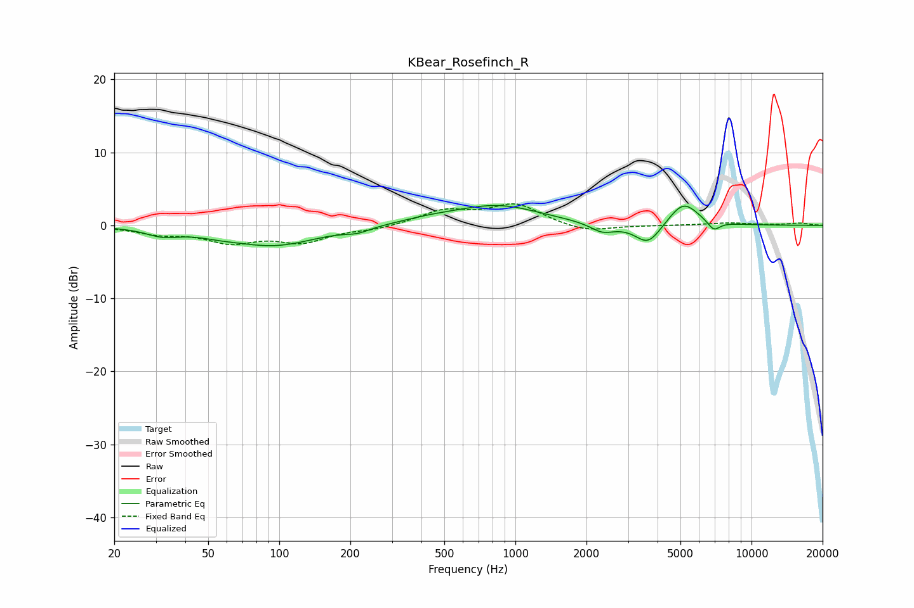

# KBear_Rosefinch_R
See [usage instructions](https://github.com/jaakkopasanen/AutoEq#usage) for more options and info.

### Parametric EQs
Apply preamp of -2.8 dB when using parametric equalizer.

|   # | Type    |   Fc (Hz) |    Q |   Gain (dB) |
|-----|---------|-----------|------|-------------|
|   1 | Peaking |        32 | 2.01 |        -1   |
|   2 | Peaking |        56 | 1.54 |        -0.5 |
|   3 | Peaking |        95 | 0.78 |        -2.7 |
|   4 | Peaking |       215 | 2.7  |        -0.6 |
|   5 | Peaking |       438 | 1.05 |         0.6 |
|   6 | Peaking |       846 | 0.79 |         2.6 |
|   7 | Peaking |      2336 | 2.74 |        -1.3 |
|   8 | Peaking |      3649 | 2.54 |        -2.9 |
|   9 | Peaking |      5150 | 2.2  |         3.3 |
|  10 | Peaking |      6918 | 5.11 |        -1.3 |

### Fixed Band EQs
When using fixed band (also called graphic) equalizer, apply preamp of **-3.0 dB** (if available) and set gains manually with these parameters.

|   # | Type    |   Fc (Hz) |    Q |   Gain (dB) |
|-----|---------|-----------|------|-------------|
|   1 | Peaking |        31 | 1.41 |        -1   |
|   2 | Peaking |        62 | 1.41 |        -2.1 |
|   3 | Peaking |       125 | 1.41 |        -2.1 |
|   4 | Peaking |       250 | 1.41 |        -0.5 |
|   5 | Peaking |       500 | 1.41 |         1.9 |
|   6 | Peaking |      1000 | 1.41 |         2.8 |
|   7 | Peaking |      2000 | 1.41 |        -1   |
|   8 | Peaking |      4000 | 1.41 |        -0   |
|   9 | Peaking |      8000 | 1.41 |         0.3 |
|  10 | Peaking |     16000 | 1.41 |         0.3 |

### Graphs

