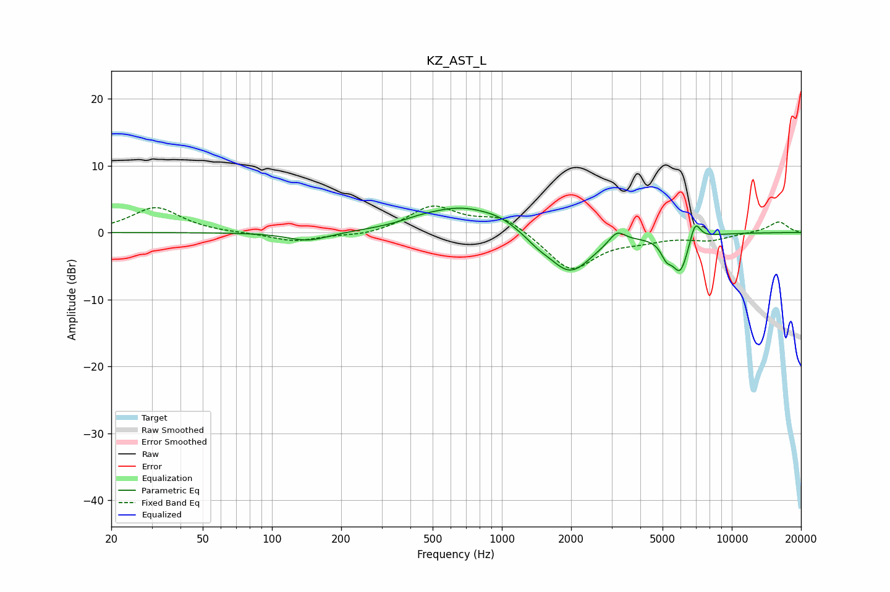

# KZ_AST_L
See [usage instructions](https://github.com/jaakkopasanen/AutoEq#usage) for more options and info.

### Parametric EQs
Apply preamp of -3.7 dB when using parametric equalizer.

|   # | Type    |   Fc (Hz) |    Q |   Gain (dB) |
|-----|---------|-----------|------|-------------|
|   1 | Peaking |       144 | 1.57 |        -1.3 |
|   2 | Peaking |       438 | 1.75 |         0.5 |
|   3 | Peaking |       670 | 0.88 |         3.7 |
|   4 | Peaking |       988 | 1.85 |         0.9 |
|   5 | Peaking |      1431 | 2.81 |        -0.8 |
|   6 | Peaking |      1977 | 1.46 |        -6.2 |
|   7 | Peaking |      3168 | 4.01 |         1.9 |
|   8 | Peaking |      5195 | 5.8  |        -2.1 |
|   9 | Peaking |      5969 | 3.83 |        -5.5 |
|  10 | Peaking |      6922 | 5.91 |         3.2 |

### Fixed Band EQs
When using fixed band (also called graphic) equalizer, apply preamp of **-4.1 dB** (if available) and set gains manually with these parameters.

|   # | Type    |   Fc (Hz) |    Q |   Gain (dB) |
|-----|---------|-----------|------|-------------|
|   1 | Peaking |        31 | 1.41 |         3.8 |
|   2 | Peaking |        62 | 1.41 |        -0.1 |
|   3 | Peaking |       125 | 1.41 |        -1.3 |
|   4 | Peaking |       250 | 1.41 |        -0.6 |
|   5 | Peaking |       500 | 1.41 |         3.9 |
|   6 | Peaking |      1000 | 1.41 |         2.5 |
|   7 | Peaking |      2000 | 1.41 |        -5.7 |
|   8 | Peaking |      4000 | 1.41 |        -0.9 |
|   9 | Peaking |      8000 | 1.41 |        -1.1 |
|  10 | Peaking |     16000 | 1.41 |         1.6 |

### Graphs

