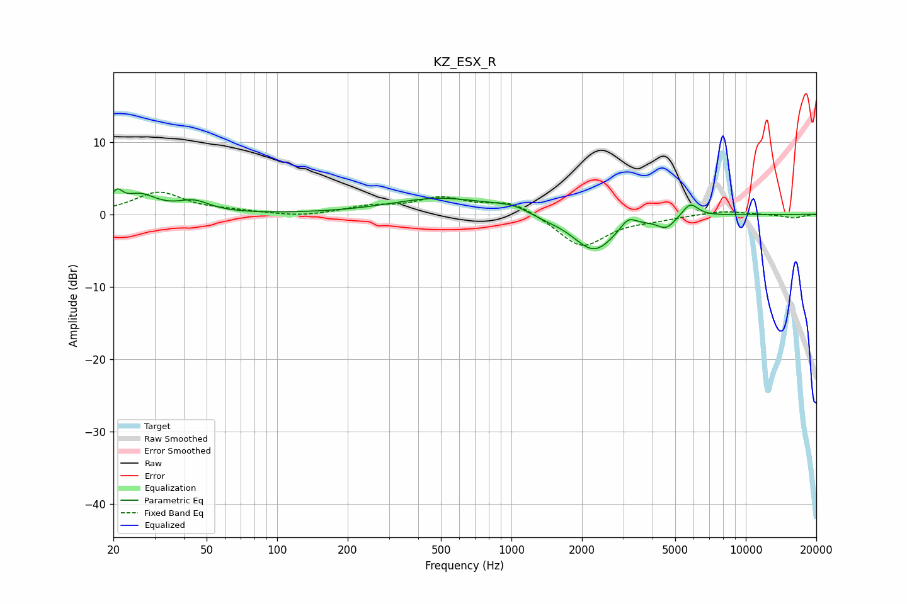

# KZ_ESX_R
See [usage instructions](https://github.com/jaakkopasanen/AutoEq#usage) for more options and info.

### Parametric EQs
Apply preamp of -3.6 dB when using parametric equalizer.

|   # | Type    |   Fc (Hz) |    Q |   Gain (dB) |
|-----|---------|-----------|------|-------------|
|   1 | Peaking |        21 | 5.94 |         2.1 |
|   2 | Peaking |        26 | 2    |         2.4 |
|   3 | Peaking |        44 | 2.04 |         1.5 |
|   4 | Peaking |       494 | 0.68 |         2.2 |
|   5 | Peaking |      1025 | 1.59 |         1   |
|   6 | Peaking |      1354 | 1.96 |        -0.5 |
|   7 | Peaking |      2252 | 1.56 |        -5.1 |
|   8 | Peaking |      3145 | 4.24 |         1.5 |
|   9 | Peaking |      4578 | 3.53 |        -1.6 |
|  10 | Peaking |      5789 | 4.02 |         1.9 |

### Fixed Band EQs
When using fixed band (also called graphic) equalizer, apply preamp of **-3.2 dB** (if available) and set gains manually with these parameters.

|   # | Type    |   Fc (Hz) |    Q |   Gain (dB) |
|-----|---------|-----------|------|-------------|
|   1 | Peaking |        31 | 1.41 |         3   |
|   2 | Peaking |        62 | 1.41 |         0.3 |
|   3 | Peaking |       125 | 1.41 |        -0.4 |
|   4 | Peaking |       250 | 1.41 |         1   |
|   5 | Peaking |       500 | 1.41 |         2.1 |
|   6 | Peaking |      1000 | 1.41 |         1.8 |
|   7 | Peaking |      2000 | 1.41 |        -4.6 |
|   8 | Peaking |      4000 | 1.41 |        -0.5 |
|   9 | Peaking |      8000 | 1.41 |         0.5 |
|  10 | Peaking |     16000 | 1.41 |        -0.5 |

### Graphs

