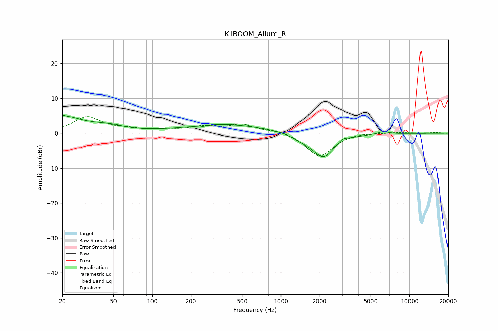

# KiiBOOM_Allure_R
See [usage instructions](https://github.com/jaakkopasanen/AutoEq#usage) for more options and info.

### Parametric EQs
Apply preamp of -5.2 dB when using parametric equalizer.

|   # | Type    |   Fc (Hz) |    Q |   Gain (dB) |
|-----|---------|-----------|------|-------------|
|   1 | Peaking |        20 | 5.47 |         1.4 |
|   2 | Peaking |        23 | 2.38 |         1.2 |
|   3 | Peaking |        25 | 0.66 |         2.9 |
|   4 | Peaking |        48 | 1.3  |         0.8 |
|   5 | Peaking |       237 | 6    |        -0.4 |
|   6 | Peaking |       379 | 0.44 |         2.6 |
|   7 | Peaking |      1421 | 2.28 |        -0.9 |
|   8 | Peaking |      2137 | 1.55 |        -7   |
|   9 | Peaking |      3016 | 3.43 |         1.2 |
|  10 | Peaking |      6249 | 3.38 |         0.8 |

### Fixed Band EQs
When using fixed band (also called graphic) equalizer, apply preamp of **-4.9 dB** (if available) and set gains manually with these parameters.

|   # | Type    |   Fc (Hz) |    Q |   Gain (dB) |
|-----|---------|-----------|------|-------------|
|   1 | Peaking |        31 | 1.41 |         4.5 |
|   2 | Peaking |        62 | 1.41 |         1   |
|   3 | Peaking |       125 | 1.41 |         0.8 |
|   4 | Peaking |       250 | 1.41 |         1.7 |
|   5 | Peaking |       500 | 1.41 |         2.3 |
|   6 | Peaking |      1000 | 1.41 |         0.9 |
|   7 | Peaking |      2000 | 1.41 |        -6.7 |
|   8 | Peaking |      4000 | 1.41 |         0.4 |
|   9 | Peaking |      8000 | 1.41 |         0.3 |
|  10 | Peaking |     16000 | 1.41 |         0.2 |

### Graphs

