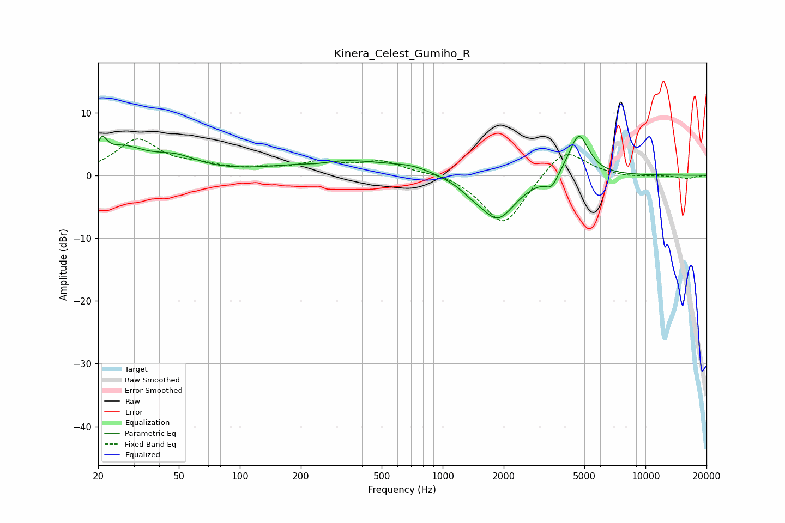

# Kinera_Celest_Gumiho_R
See [usage instructions](https://github.com/jaakkopasanen/AutoEq#usage) for more options and info.

### Parametric EQs
Apply preamp of -6.3 dB when using parametric equalizer.

|   # | Type    |   Fc (Hz) |    Q |   Gain (dB) |
|-----|---------|-----------|------|-------------|
|   1 | Peaking |        21 | 5.96 |         3   |
|   2 | Peaking |        26 | 1.28 |         3.8 |
|   3 | Peaking |        48 | 1.24 |         2.2 |
|   4 | Peaking |       239 | 1.95 |        -0.5 |
|   5 | Peaking |       315 | 0.54 |         2.5 |
|   6 | Peaking |       712 | 1.53 |         0.8 |
|   7 | Peaking |      1377 | 2.63 |        -0.8 |
|   8 | Peaking |      1863 | 1.55 |        -7   |
|   9 | Peaking |      3446 | 4.65 |        -2   |
|  10 | Peaking |      4691 | 2.8  |         6.9 |

### Fixed Band EQs
When using fixed band (also called graphic) equalizer, apply preamp of **-5.9 dB** (if available) and set gains manually with these parameters.

|   # | Type    |   Fc (Hz) |    Q |   Gain (dB) |
|-----|---------|-----------|------|-------------|
|   1 | Peaking |        31 | 1.41 |         5.5 |
|   2 | Peaking |        62 | 1.41 |         1.2 |
|   3 | Peaking |       125 | 1.41 |         0.7 |
|   4 | Peaking |       250 | 1.41 |         1.8 |
|   5 | Peaking |       500 | 1.41 |         2.1 |
|   6 | Peaking |      1000 | 1.41 |         0.6 |
|   7 | Peaking |      2000 | 1.41 |        -8.3 |
|   8 | Peaking |      4000 | 1.41 |         4.8 |
|   9 | Peaking |      8000 | 1.41 |        -0.4 |
|  10 | Peaking |     16000 | 1.41 |        -0.5 |

### Graphs

